# Orchestrator Service ("The Brain")

The **Orchestrator** is the central cognitive engine of Kea. It implements the **Agentic OODA Loop** (Observe, Orient, Decide, Act) using **LangGraph** to manage state, recursion, and decision-making. 

It is responsible for breaking down user queries, coordinating MCP tools, and synthesizing final yields.

---

## 🏗️ Architecture Overview

The Orchestrator operates as a **Cyclic State Machine**, allowing it to "Think Fast" (Router) and "Think Slow" (Deep Research Loop).

1.  **Planning Layer**: Decomposes complex queries into atomic micro-tasks.
2.  **Execution Layer**: Distributes tasks to MCP Tools (Scraper, Analyst).
3.  **Control Layer**: The "Keeper" monitors for context drift and hallucinations.
4.  **Consensus Layer**: Adversarial Agents (Generator vs Critic) verify the final output.


---

## 📁 Codebase Structure & Reference

| File / Directory | Component | Description | Key Classes/Functions |
|:-----------------|:----------|:------------|:----------------------|
| **`main.py`** | **Entry Point** | FastAPI app for the service. Manages lifecycle events. | `create_app()`, `startup_event()` |
| **`core/`** | **Nervous System** | Core pipeline logic and state definitions. | |
| ├── `graph.py` | State Machine | Defines the LangGraph nodes (Planner, Researcher) and edges. | `compile_research_graph()` |
| ├── `router.py` | Classifier | Determines if a query needs Research or simple Chat. | `IntentionRouter.route()` |
| ├── `pipeline.py` | Runner | Manages the async event loop for a single job. | `ConversationResearchPipeline.run()` |
| **`nodes/`** | **Graph Nodes** | Deterministic steps in the state machine. | |
| ├── `planner.py` | Strategy | Breaks query into micro-tasks (Plan JSON). | `planner_node()` |
| ├── `researcher.py` | Muscle | Iterates plan and calls MCP tools. | `researcher_node()` |
| ├── `keeper.py` | Controller | Checks sufficiency and context drift. | `keeper_node()` |
| ├── `synthesizer.py`| Output | Formats final markdown report. | `synthesizer_node()` |
| **`agents/`** | **Personas** | LLM Agents for the Consensus Engine. | |
| ├── `generator.py` | Optimist | Drafts initial answer. | `GeneratorAgent` |
| ├── `critic.py` | Pessimist | Audits draft for fallacies. | `CriticAgent` |
| ├── `judge.py` | Arbiter | Decides to Approve or Revise. | `JudgeAgent` |
| **`mcp/`** | **Integration** | Infrastructure to talk to tool servers. | `MCPOrchestrator` |

---

## 🔬 Deep Dive: Key Subsystems

### 1. The Cyclic State Graph (`core/graph.py`)
Unlike linear chains (LangChain), Kea uses a **Graph**. This allows the system to:
*   **Loop**: Go back to the Researcher if the data is insufficient.
*   **Fork**: Spawn parallel research paths if the hypothesis splits.
*   **Correct**: The Critic node can reject a draft and force a rewrite.

### 2. The Keeper Protocol (`nodes/keeper.py`)
The Keeper is the "Traffic Cop" of the brain. It prevents the infinite loop problem common in autonomous agents.
*   **Drift Detection**: Scores current facts against the original User Intent vector.
*   **Sufficiency Check**: Determines if we have enough facts to answer the question without hallucination.
*   **Yield Control**: Decides when to stop researching and start writing.

### 3. Adversarial Collaboration (`agents/`)
To maximize accuracy, we use a multi-persona boardroom simulation:
*   **Generator**: "I have found these facts, here is the conclusion."
*   **Critic**: "You missed the date on the second fact. Source B is unreliable."
*   **Judge**: "Objection sustained. Generator, re-write section 2."

---

## 🔌 API Node Reference (Internal)

While the Orchestrator is usually called via `main.py`, the core Logic Units (Nodes) are distinct inputs/outputs.

### 1. Planning Layer
| Node | Input | Output | Description |
|:-----|:------|:-------|:------------|
| `router` | `Query` (str) | `Path` (str) | Classifies intent (RESEARCH vs CHAT). |
| `planner` | `Query` (str) | `ExecutionPlan` (JSON) | Generates step-by-step checklist. |

### 2. Execution Layer
| Node | Input | Output | Description |
|:-----|:------|:-------|:------------|
| `researcher` | `Plan` | `Facts` (List[str]) | Executes tools and gathers data. |
| `keeper` | `Facts` | `Decision` (Continue/Stop) | Validates data sufficiency. |

### 3. Consensus Layer
| Node | Input | Output | Description |
|:-----|:------|:-------|:------------|
| `generator` | `Facts` | `Draft` (Markdown) | Writes the first draft. |
| `critic` | `Draft` | `Feedback` (List[str]) | Finds errors in the draft. |
| `judge` | `Feedback` | `Verdict` (Approve/Revise) | Final decision maker. |

### 4. Output Layer
| Node | Input | Output | Description |
|:-----|:------|:-------|:------------|
| `synthesizer` | `Draft` | `Report` (Markdown) | Final polish and formatting. |

---

## 🚀 Usage

To run the Orchestrator service in isolation (for development):

```bash
# Start the service
python -m services.orchestrator.main
```

---

## 🔮 Future Enterprise Integration Architecture
The following diagram illustrates how the currently dormant "Enterprise" modules (`compliance.py`, `audit_trail.py` etc.) will be wired into the existing `graph.py` execution loop without rewriting the core.

```mermaid
graph TD
    %% -- Core Pipeline --
    User((User)) -->|Query| API[API Gateway]
    API -->|Start Job| Graph[Graph State Machine]
    
    %% -- Planning --
    Graph -->|Route| Planner[Planner Node]
    Planner -->|Decompose| Spawner{Agent Spawner}
    
    %% -- Fractal Expansion (agent_spawner.py) --
    subgraph Fractal Swarm
        Spawner -->|Spawn| Agent1[Research Agent 1]
        Spawner -->|Spawn| Agent2[Financial Agent 2]
        Spawner -->|Spawn| Agent3[Legal Agent 3]
    end
    
    %% -- Execution Logic --
    Agent1 -->|Tool Call| Workflow{Approval Workflow}
    
    %% -- Gatekeepers (approval_workflow.py) --
    subgraph Corporate Governance
        Workflow --"High Cost / Risk"--> HITL((Human Admin))
        HITL --"Approve"--> Compliance{Compliance Engine}
        Workflow --"Safe"--> Compliance
    end
    
    %% -- Safety (compliance.py) --
    Compliance --"GDPR Check"--> Rule1[Data Minimization]
    Compliance --"ISO27001"--> Rule2[Security Scan]
    
    %% -- Action --
    Rule1 & Rule2 -->|Pass| MCP[MCP Tool Client]
    
    %% -- The Black Box (audit_trail.py) --
    MCP -.->|Log Action| Audit[(Audit Trail DB)]
    Graph -.->|Log State| Audit
    Compliance -.->|Log Decision| Audit
    
    %% -- Styles --
    classDef core fill:#222,stroke:#fff,stroke-width:2px;
    classDef dormant fill:#2d1b1b,stroke:#f55,stroke-width:2px,stroke-dasharray: 5 5;
    classDef active fill:#1b2d1b,stroke:#5f5,stroke-width:2px;
    
    class Graph,Planner,MCP active;
    class Spawner,Workflow,Compliance,Audit dormant;
```



### Integration Wiring Guide
| Active Component | Dormant Module | Integration Method |
|:-----------------|:---------------|:-------------------|
| `nodes/researcher.py` | `core/compliance.py` | Wrap tool calls: `compliance.check(tool, args)` |
| `core/graph.py` | `core/audit_trail.py` | Add `@audited` decorator to node functions. |
| `mcp/client.py` | `core/approval_workflow.py` | In `call_tool`, check `workflow.requires_approval()`. |
| `nodes/planner.py` | `core/agent_spawner.py` | Replace loop with `spawner.spawn_swarm(plan)`. |
