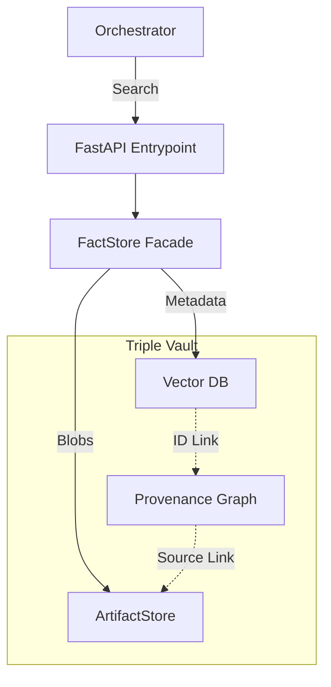

# RAG Service ("The Memory")

The **RAG Service** is the persistent memory system of Kea. It implements a "Triple Vault" architecture to store varying granularities of information:
1.  **Atomic Facts**: Precision-recall for verification.
2.  **Semantic Vectors**: Fuzzy search for exploration.
3.  **Raw Artifacts**: Heavy file storage for source documents.

---

## 🏗️ Architecture Overview

The system abstracts retrieval complexity behind a unified facade known as the **FactStore**.



---

## 📁 Codebase Structure & Reference

| File / Directory | Component | Description | Key Classes/Functions |
|:-----------------|:----------|:------------|:----------------------|
| **`main.py`** | **Entry Point** | FastAPI service definition and route handlers. | `lifespan()`, `add_fact()` |
| **`core/`** | **Logic** | Storage abstractions. | |
| ├── `fact_store.py` | Facade | The high-level API for adding/searching facts. Ties vector + graph together. | `FactStore` |
| ├── `vector_store.py`| Vector DB | Adapter for Qdrant/Chroma. Handles embedding generation. | `create_vector_store()` |
| ├── `artifact_store.py`| Object DB | Adapter for S3/LocalFS. Handles large file I/O. | `ArtifactStore` |
| **`api/`** | **Routes** | (Legacy) Split route modules. | - |
| **`schemas/`** | **Models** | Pydantic data models for API contracts. | `AtomicFact`, `FactResponse` |

---

## 🔬 Deep Dive: The Triple Vault

### 1. Atomic Fact Vault (Qdrant)
Instead of chunking text blindly, Kea stores **Atomic Facts**.
*   **Structure**: Entity-Attribute-Value (EAV).
*   **Example**: `{"entity": "Nvidia", "attribute": "Revenue 2024", "value": "$60B"}`.
*   **Benefit**: Eliminates "lost in the middle" hallucination issues common in long-context retrieval.

### 2. Artifact Vault (Blob Store)
Stores the "Ground Truth" documents.
*   **Content**: PDFs, HTML snapshots, CSVs.
*   **Linkage**: Every Atomic Fact has a `source_id` pointing to a file in the Artifact Vault, enabling "Click-to-Verify" citations.

### 3. Provenance Graph (NetworkX)
(In-Memory / Experimental) Tracks the derivation chain.
*   **Usage**: "How do we know Nvidia revenue is $60B?" -> "Derived from Artifact #123 (Quarterly Report), page 5."

---

## 🔌 API Endpoint Structure

### 1. Fact Management
Core CRUD for the atomic knowledge base.

| Endpoint | Method | Description |
|:---------|:-------|:------------|
| `/facts` | `POST` | Insert a new atomic fact. |
| `/facts/search` | `POST` | Semantic search (Vector + Keyword) for facts. |
| `/facts/{id}` | `GET` | Retrieve a specific fact by UUID. |
| `/facts/{id}` | `DELETE` | Remove a fact (e.g., if proven false). |

### 2. Entity Exploration
 Browsing the knowledge graph.

| Endpoint | Method | Description |
|:---------|:-------|:------------|
| `/entities` | `GET` | List all unique entities (e.g., "Tesla", "Musk"). |
| `/entities/{id}` | `GET` | Get all facts associated with an entity. |

### 3. System
Service health and monitoring.

| Endpoint | Method | Description |
|:---------|:-------|:------------|
| `/health` | `GET` | Check connection to Vector DB and Artifact Store. |

---

## 🚀 Usage

To start the RAG service independently:

```bash
# Run on port 8001
uvicorn services.rag_service.main:app --port 8001
```
