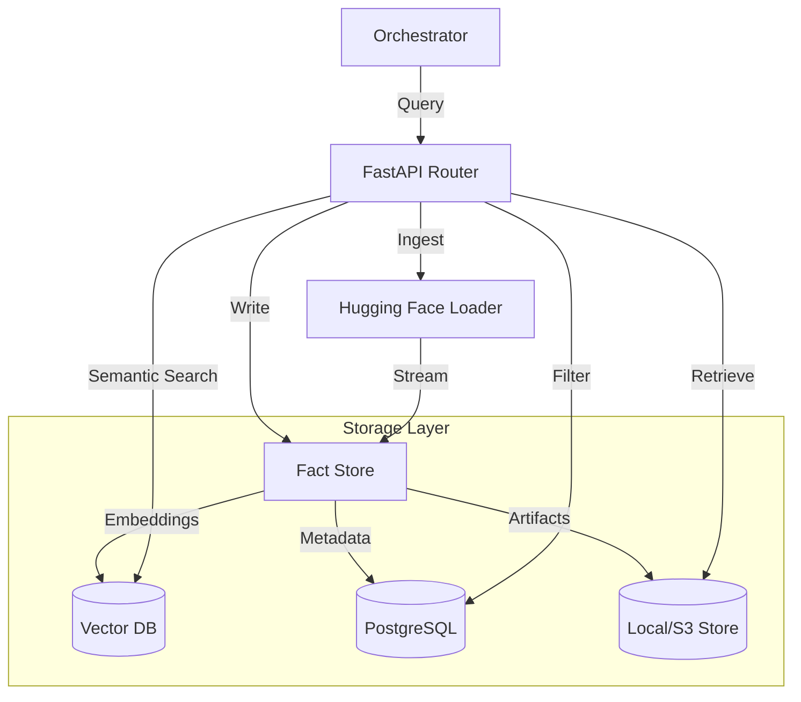

# 🗄️ RAG Service ("The Memory")

The **RAG (Retrieval-Augmented Generation) Service** provides the long-term memory and knowledge base for the Kea system. It manages the storage, indexing, and semantic retrieval of "Atomic Facts" extracted during research, as well as the management of larger research artifacts like datasets and documents.

## ✨ Features

- **Atomic Fact Model**: Stores information in a granular, structured format (Entity-Attribute-Value) to enable high-precision retrieval and contradiction resolution.
- **Hybrid Search Engine**: Combines vector-based semantic search with discrete metadata filtering (e.g., entity, dataset, confidence score).
- **Plug-and-Play Vector Stores**: Supports multiple backends including Qdrant, PostgreSQL (pgvector), and high-performance in-memory options.
- **Hugging Face Integration**: Native `DatasetLoader` for streaming and ingesting massive-scale external datasets directly into the research memory.
- **Research Artifact Store**: Dedicated storage for large-scale data artifacts (CSVs, Excel, JSON) with support for Local and S3-compatible backends.
- **Provenance Tracking**: Maintains strict association between every fact and its source URL, title, and extraction timestamp.

---

## 📐 Architecture

The RAG Service operates as a **Triple-Store Abstraction Layer**, managing three distinct types of data:

1.  **Vector Store**: High-dimensional embeddings of facts for semantic similarity search.
2.  **Metadata Store**: Structured properties (Confidence, Entity, Time Period) for deterministic filtering.
3.  **Artifact Store**: Binary/BLOB storage for the raw evidence and research outcomes.

### 🗼 Topology: Information Ingestion 

---

## 📁 Codebase Structure

- **`main.py`**: FastAPI entrypoint hosting the facts and datasets API.
- **`core/`**: The implementation of the storage and loading logic.
    - `fact_store.py`: Orchestrates the `AtomicFact` lifecycle across vector and metadata stores.
    - `artifact_store.py`: Implementation of Local and S3 storage for large research files.
    - `dataset_loader.py`: Integration with Hugging Face `datasets` for streaming ingestion.
    - `graph_rag.py`: (Experimental) Implements semantic relationship mapping between extracted facts.
    - `postgres_artifacts.py`: Database-backed persistence for artifact metadata.
- **`api/`**: API request and response schemas.

---

## 🧠 Deep Dive

### 1. The Atomic Fact Pattern
Every finding in Kea is normalized into an `AtomicFact`:
- **Entity**: "Nickel Production"
- **Attribute**: "Global Volume 2023"
- **Value**: "3.6 Million Metric Tons"
- **Context**: Unit, Period, Source URL, Confidence Score.

This normalization allows the Orchestrator's **Consensus Engine** to compare findings from different sources at a granular level, detecting contradictions even when the surrounding text differs.

### 2. High-Throughput Ingestion
The `DatasetLoader` is designed for scale. When a Hugging Face dataset is ingested (e.g., via `/datasets/ingest`), the service spawns a background task that streams rows, maps them to the atomic schema using a dynamic field map, and batch-inserts them into the vector store. This enables Kea to "read" thousands of rows of structured data in seconds.

### 3. Artifact Provenance
Large files created during research (like a generated stock comparison CSV) are stored in the `ArtifactStore`. The service ensures that these artifacts are indexed alongside the facts they support, allowing the system to provide "Full Evidence Disclosure"—linking a high-level report claim back to the specific line in a generated spreadsheet.

---

## 📚 Reference

### API Interface

| Endpoint | Method | Description |
|:---------|:-------|:------------|
| `/facts` | `POST` | Manually add a verified atomic fact. |
| `/facts/search` | `POST` | Perform semantic and filtered search across facts. |
| `/datasets/ingest` | `POST` | Trigger background ingestion from Hugging Face. |
| `/entities` | `GET` | List all unique entities currently known to the system. |
| `/artifacts` | `GET` | List available research artifacts by job ID. |
| `/health` | `GET` | Service status and initialization checks. |
