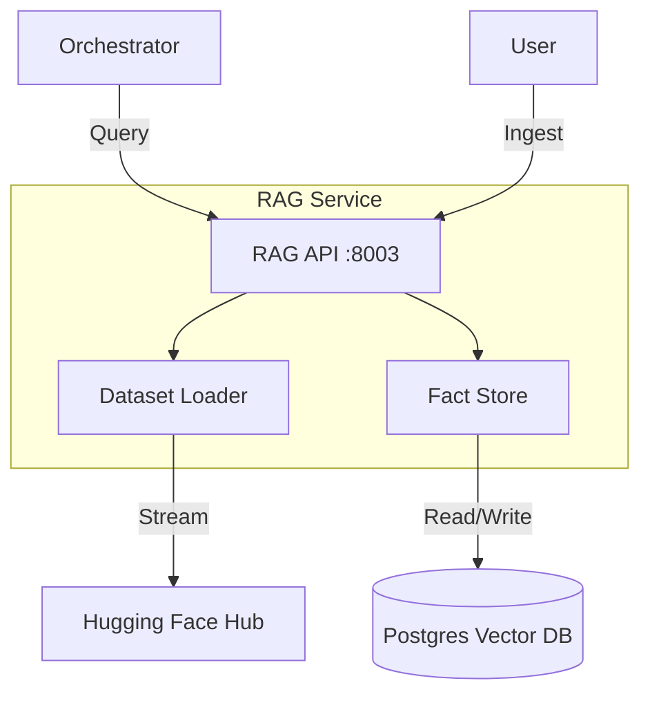

# 📚 RAG Service (External Knowledge Engine)

The **RAG Service** is the dedicated engine for ingesting, managing, and searching **External Knowledge Bases** (e.g., Hugging Face datasets, Wikipedia dumps, specialized corpora).

Unlike the **Vault**, which acts as the system's "Working Memory" (storing facts learned *during* research), the RAG Service manages **Long-Term Static Knowledge** that can be loaded on-demand.

---

## 🏗️ Architecture

The RAG Service shares the global PostgreSQL infrastructure but manages its own logical namespace for datasets.

## 🚀 Features

- **Hugging Face Integration**: Stream and ingest any dataset from the Hugging Face Hub.
- **Dataset Management**: Load specific datasets (e.g., `fine-web`, `legal-text`) and unload them when no longer needed.
- **Semantic Search**: High-performance vector search over ingested external knowledge.

## 🔌 API Reference

### Ingestion
- `POST /datasets/ingest`: Trigger a background job to ingest a dataset.
  - `dataset_name`: e.g. "wikipedia"
  - `split`: e.g. "train"
  - `max_rows`: Limit ingestion size.

### Management
- `GET /datasets`: List currently loaded datasets.
- `DELETE /datasets/{dataset_id}`: Remove a dataset from the vector store.

### Retrieval
- `POST /facts/search`: Standard semantic search endpoint (compatible with Vault interface).
