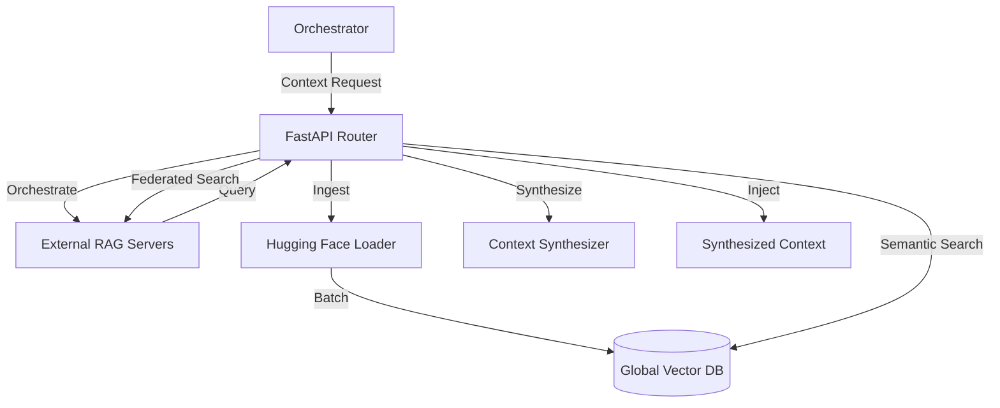

# 🗄️ RAG Service ("The Memory")

The **RAG (Retrieval-Augmented Generation) Service** provides the reference intelligence and global knowledge orchestration layer for the Kea v4.0 system. It functions as the **Corporate Library & Controller**, managing access to massive, external, or multiple distinct RAG servers via API. It handles the ingestion of global datasets and feeds synthesized reference context into the research process.

## ✨ Features

- **Atomic Fact Model**: Stores information in a granular, structured format (Entity-Attribute-Value) to enable high-precision retrieval and contradiction resolution.
- **Hybrid Search Engine**: Combines vector-based semantic search with discrete metadata filtering (e.g., entity, dataset, confidence score).
- **GraphRAG Engine**: (Experimental) In-memory knowledge graph for tracking relationships between entities, facts, and sources, enabling provenance tracking and contradiction detection.
- **Plug-and-Play Vector Stores**: Supports multiple backends including Qdrant, PostgreSQL (pgvector), and high-performance in-memory options.
- **Hugging Face Integration**: Native `DatasetLoader` for streaming and ingesting massive-scale external datasets directly into the research memory.
- **Provenance Tracking**: Maintains strict association between every fact and its source URL, title, and extraction timestamp.

## 📐 Architecture

The RAG Service operates as a **Triple-Store Abstraction Layer**, managing three distinct types of data:

1.  **Vector Store**: High-dimensional embeddings of facts for semantic similarity search.
2.  **Metadata Store**: Structured properties (Confidence, Entity, Time Period) for deterministic filtering.
3.  **Knowledge Graph**: Relational connections between entities and sources.

### 🗼 Topology: Information Ingestion 

## 📁 Codebase Structure

- **`main.py`**: FastAPI entrypoint (v0.2.0) hosting the facts, datasets, and knowledge API.
- **`core/`**: The implementation of the storage and loading logic.
    - `fact_store.py`: Implementation of the `FactStore` protocol for the Kernel.
    - `knowledge_store.py`: Semantic search for system-level knowledge (skills, rules, personas).
    - `artifact_store.py`: Implementation of Local and S3 storage for large research files.
    - `dataset_loader.py`: Integration with Hugging Face `datasets` for streaming ingestion.

## 🧠 Deep Dive

### 1. The Atomic Fact Pattern
Every finding in Kea is normalized into an `AtomicFact` (Entity-Attribute-Value). This normalization allows the Orchestrator's **Consensus Engine** to compare findings from different sources at a granular level.

### 2. High-Throughput Ingestion
The `DatasetLoader` streams rows from Hugging Face, maps them to the atomic schema, and batch-inserts them into the vector store.

### 3. Knowledge Store
Unlike `FactStore` which manages dynamic research findings, the `KnowledgeStore` indexes static system assets from the `knowledge/` directory. This includes agent "Skills," compliance "Rules," and "Personas."

## 📚 Reference

### API Interface (v0.2.0)

| Endpoint | Method | Description |
|:---------|:-------|:------------|
| `/facts/search` | `POST` | Perform semantic and filtered search across facts. |
| `/knowledge/search` | `POST` | Semantic search for system skills, rules, and personas. |
| `/datasets/ingest` | `POST` | Trigger background ingestion from Hugging Face. |
| `/entities` | `GET` | List all unique entities currently known. |
| `/knowledge/sync` | `POST` | Sync vector index with files in `knowledge/` directory. |
| `/health` | `GET` | Service status and initialization checks. |
