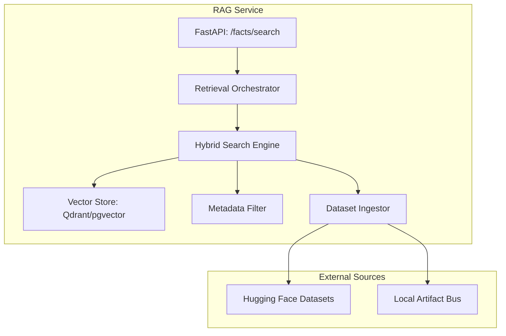

# 🗄️ RAG Service ("The Library")

The **RAG (Retrieval-Augmented Generation) Service** provides the global knowledge orchestration layer for Project. It functions as the **Librarian**, managing access to massive external datasets and multiple distinct RAG backends via a unified API.

## 📐 Architecture

The RAG Service operates as a **Federated Search Abstraction**. It decouples the source of information (Hugging Face, Local PDFs, Web Scrapes) from the Kernel's retrieval needs.

### Component Overview

| Component | Responsibility | Cognitive Role |
| :--- | :--- | :--- |
| **Retrieval Orch** | Coordinates federated search across backends. | Semantic Search |
| **Hybrid Engine** | Combines vector distance with metadata tagging. | Insight Retrieval |
| **Dataset Ingestor**| Streams and indexes massive HF datasets. | Knowledge Ingestion |
| **Metadata Store** | Manages tags (Origin, Confidence, Time). | Relational Context |

---

## ✨ Key Features

### 1. Atomic Insight Model
Every finding in Kea is normalized into an `AtomicInsight` (Entity-Attribute-Value). This normalization allows the Orchestrator's **Reasoning Engine** to compare findings from different sources at a granular level, resolving contradictions before they reach the final output.

### 2. High-Throughput Ingestion
The `DatasetLoader` streams rows from Hugging Face or the local **Artifact Bus**, maps them to the atomic schema, and batch-inserts them into the vector store. This allows Project to "learn" about a new domain (e.g., 10,000 regulatory documents) in minutes.

### 3. Provenance & Citation Tracking
Every insight stored in the Library maintains a strict association with its origin URL, document title, and creation timestamp. This ensures that every claim in a system-generated output can be traced back to a specific, verified origin.

---

## 📁 Codebase Structure

- **`main.py`**: FastAPI entrypoint hosting the insights, datasets, and knowledge API.
- **`core/`**: The implementation of the storage and loading logic.
    - `fact_store.py`: The concrete implementation of the `FactStore` protocol.
    - `knowledge_store.py`: Semantic search for system-level knowledge (skills/rules).
    - `dataset_loader.py`: Integration with Hugging Face `datasets` for JIT ingestion.
    - `artifact_store.py`: Interface for high-fidelity data persistence.

---

## 🧠 Deep Dive

### 1. Federated Semantic Search
When the Kernel requests an insight, the RAG service doesn't just check one database. It performs **Composite Retrieval**:
1.  **Global Knowledge**: Checks the long-term knowledge base.
2.  **Job Context**: Checks the private store for the current execution session.
3.  **Metadata Overlay**: Filters results by time-period and confidence thresholds.

### 2. Contradiction Detection
The Library uses semantic clustering to identify contradictory insights (e.g., Origin A says "Price is $10" while Origin B says "Price is $12"). These are flagged for the **Reasoning Node** in the Orchestrator to resolve during the "Context Hygiene" phase.

---
*The RAG Service provides the evidence that grounds Project's reasoning in physical reality.*

