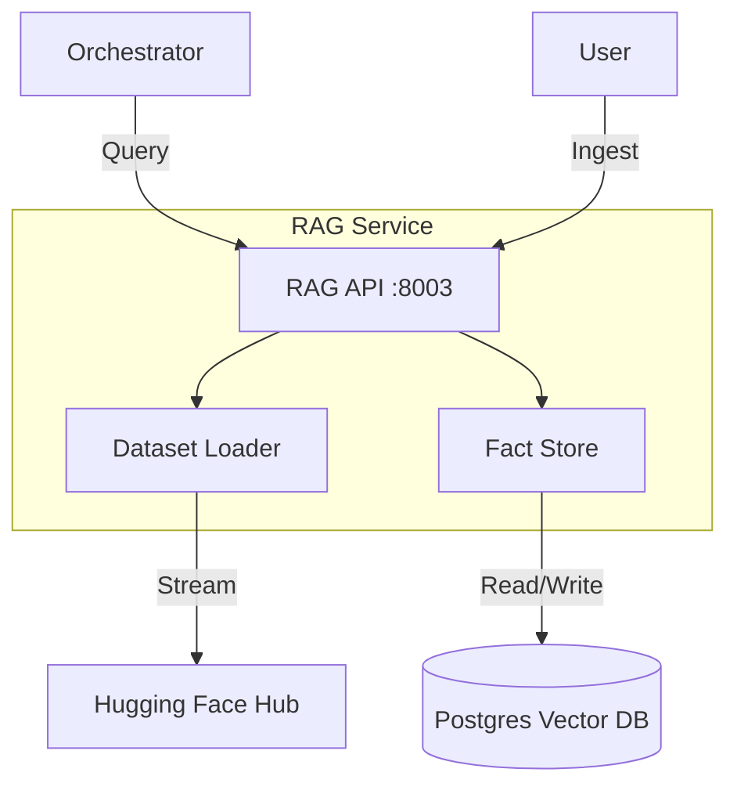
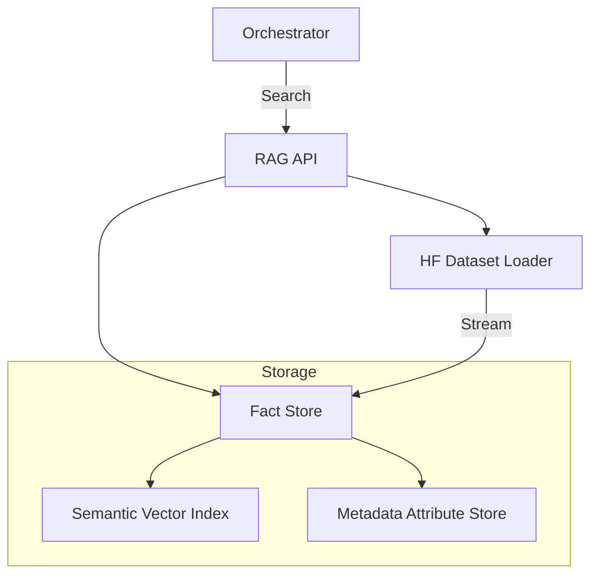

# 📚 RAG Service (External Knowledge Engine)

The **RAG Service** is the dedicated engine for ingesting, managing, and searching **External Knowledge Bases** (e.g., Hugging Face datasets, Wikipedia dumps, specialized corpora).

Unlike the **Vault**, which acts as the system's "Working Memory" (storing facts learned *during* research), the RAG Service manages **Long-Term Static Knowledge** that can be loaded on-demand.

---

## 🏗️ Architecture

The RAG Service shares the global PostgreSQL infrastructure but manages its own logical namespace for datasets.

## 📁 Codebase Structure

| File / Directory | Component | Description |
|:-----------------|:----------|:------------|
| **`main.py`** | **Entry Point** | FastAPI service (Port 8003). |
| **`core/`** | **Logic** | Core knowledge engines. |
| ├── `fact_store.py` | Fact DB | Manages atomic facts and vector search. |
| ├── `dataset_loader.py`| HF Integrator| Streams and maps datasets from Hugging Face. |
| ├── `artifact_store.py`| Storage | Logic for storing large binary clusters/artifacts. |
| └── `graph_rag.py` | Graph Logic | **NEW**: Implements graph-based retrieval over facts. |

The RAG Service implements a **Fact-First Storage Architecture** designed for high-fidelity research retrieval:

1.  **Atomic Fact Store**: Instead of large document chunks, Kea stores "Atomic Facts" (Entity-Attribute-Value triples). This prevents context pollution and increases retrieval precision.
2.  **Vector Retrieval Engine**: Uses high-dimensional embeddings to map semantic queries to atomic facts.
3.  **Hugging Face Ingestion Engine**: A background streaming worker (`DatasetLoader`) that can ingest millions of facts from HF datasets without blocking primary research operations.

---

## ✨ Features

### 📋 Atomic Fact Schema
To ensure 100% factual provenance, every fact stored in Kea contains:
- **Entity/Attribute/Value**: The core proposition (e.g., `Apple` | `Revenue` | `$394.3B`).
- **Confidence Scalar**: A `0.0 - 1.0` score representing the extraction quality.
- **Reference Binding**: Direct URL and page mapping back to the source document.
- **Temporal Context**: The `period` or `timestamp` the fact pertains to.

### 🌐 High-Scale Dataset Ingestion
- **Generic HF Streaming**: Ingest any dataset from Hugging Face by providing a schema mapping (JSON → Atomic Fact).
- **Batch Processing**: Uses a buffered ingestion strategy (50 facts per batch) to maintain DB health during large-scale imports.
- **Deduplication Logic**: Automatically prevents identical facts from the same source from being indexed multiple times.

### 🔍 Multi-Domain Retrieval
- **Entity Filtering**: Narrow search results to specific entities (e.g., "Only show facts about Pfizer").
- **Dataset Isolation**: Search within specific knowledge silos (e.g., "Only use the PubMed dataset").
- **Confidence Gating**: Filter for high-certainty facts (e.g., `min_confidence=0.9`).
- **Dataset Management**: Load specific datasets (e.g., `fine-web`, `legal-text`) and unload them when no longer needed.
- **Semantic Search**: High-performance vector search over ingested external knowledge.

## 🔌 API Reference

### Ingestion
- `POST /datasets/ingest`: Trigger a background job to ingest a dataset.
  - `dataset_name`: e.g. "wikipedia"
  - `split`: e.g. "train"
  - `max_rows`: Limit ingestion size.

### Management
- `GET /datasets`: List currently loaded datasets.
- `DELETE /datasets/{dataset_id}`: Remove a dataset from the vector store.

### Fact Management
- `POST /facts`: Add a new atomic fact. 
- `GET /facts/{fact_id}`: Retrieve a specific fact.
- `DELETE /facts/{fact_id}`: Remove a fact.
- `GET /entities`: List all unique entities in the store.

### Retrieval
- `POST /facts/search`: Semantic search against the vector store.
  - `query`: Search string.
  - `dataset_id`: Filter by specific dataset.
  - `min_confidence`: Filter by confidence score.
