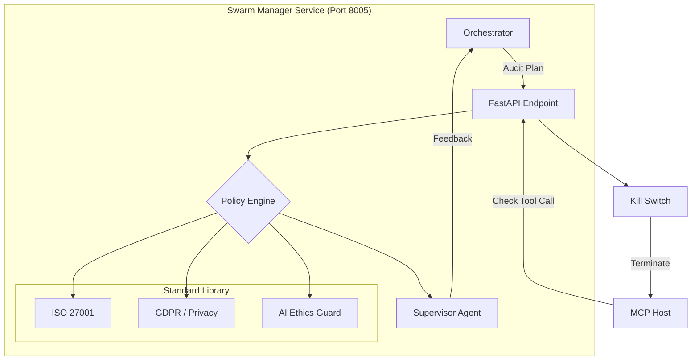

# 🐝 Swarm Manager ("The Conscience")

The **Swarm Manager** is the governance, oversight, and policy enforcement layer of the Kea system. it ensures that all autonomous actions taken by the Orchestrator and MCP Host adhere to organizational policies, safety standards, and legal compliance (ISO/SOC2/GDPR).

---

## 🏗️ Architecture Overview

The Swarm Manager acts as a **Policy Enforcement Point (PEP)**. It doesn't execute research tasks; it audits intentions and supervises the health and ethics of the agent swarm.

1.  **Compliance Engine**: Statistically and semantically validates tool arguments against a library of `ComplianceStandard` rules.
2.  **Supervisor Agent**: A high-reasoning LLM that "reads over the shoulder" of researchers to detect hallucinations or unethical reasoning.
3.  **Kill Switch**: Hardware-level interceptor that broadcast emergency halts if a security breach is detected.
4.  **Resource Guard**: Monitors CPU/RAM overhead of agent processes to prevent DDoS-by-Agent scenarios.

---

## 📁 Codebase Structure

| File / Directory | Component | Description | Key Functions/Classes |
|:-----------------|:----------|:------------|:----------------------|
| **`main.py`** | **Entry Point** | FastAPI app (Port 8005). Exposes compliance and status checks. | `check_compliance()`, `get_health()` |
| **`core/`** | **Logic** | Governance and supervision modules. | |
| ├── `compliance.py` | Engine | Core logic for matching operations against policy sets. | `PolicyEngine`, `validate_args()` |
| ├── `supervisor.py` | Observer | LLM-based watchdog for real-time thought auditing. | `SupervisorAgent`, `audit_thought()` |
| ├── `guards.py` | Resource | Enforces resource quotas and rate limits per agent. | `ResourceMonitor`, `check_quota()` |
| └── `kill_switch.py`| Shield | Logic to broadcast emergency halt to the MCP Host. | `trigger_kill_switch()`, `EmergencyHalt` |

---

## 🏗️ Technical Deep Dive

### 1. Adversarial Thought Auditing (`core/supervisor.py`)
The Swarm Manager implements a "Zero-Trust" architectural pattern for Agent reasoning:
- **Shadow Auditing**: The Supervisor Agent receives internal LangGraph state transitions *before* they are committed to the Vault.
- **Conflict Detection**: It specifically looks for cases where an agent ignores a user constraint or displays "Goal Drift" (e.g., drifting from "Research Finance" to "Write Code for X").
- **Intervention**: If the Supervisor detects a critical flaw, it injects a `CRITIC_EXCEPTION` into the Orchestrator's state, forcing the graph to backtrack.

### 2. Multi-Standard Compliance Enforcer (`core/compliance.py`)
Kea supports enterprise-grade guardrails for data access:
- **URL Whitelisting/Blacklisting**: Prevents scrapers from accessing restricted domains (e.g., internal intranets, phishing sites).
- **Redaction Logic**: Detects PII (Personally Identifiable Information) in tool outputs and redacts it before it reaches the reasoning LLM.
- **Argument Sanitization**: Ensures that tools like `execute_code` never receive destructive arguments (e.g., `rm -rf /`).

---

## 🔌 API Reference

### 1. Governance
| Endpoint | Method | Description |
|:---------|:-------|:------------|
| `/compliance/check` | `POST` | Primary gate for tool calls. Returns `passed` or `failed`. |
| `/policies/list` | `GET` | List active compliance frameworks (e.g., GDPR, SOC2). |
| `/policies/update` | `PUT` | Hot-swap policy rules without restarting the service. |

### 2. Supervision & Safety
| Endpoint | Method | Description |
|:---------|:-------|:------------|
| `/supervisor/audit` | `POST` | Submit an agent's reasoning chain for auditing. |
| `/safety/kill` | `POST` | Trigger the emergency kill switch for all active tools. |
| `/guards/metrics` | `GET` | View resource usage and quota status per agent. |
