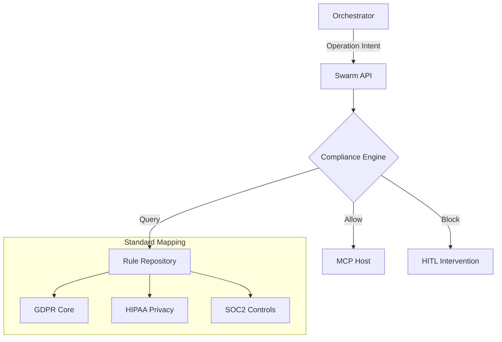
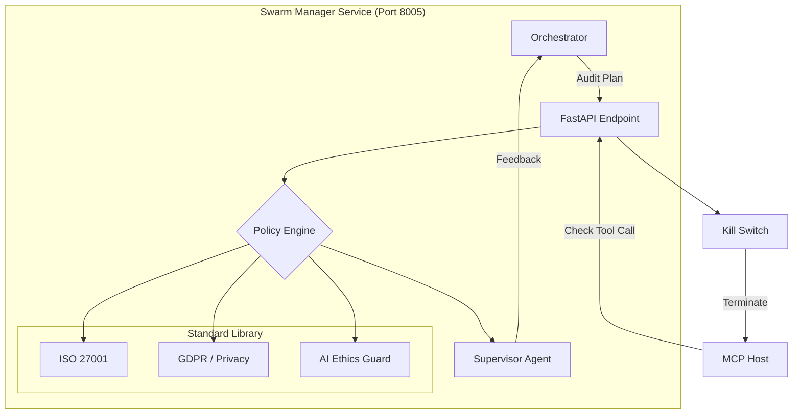

# 🐝 Swarm Manager ("The Conscience")

The Swarm Manager serves as the Kea **Governance Engine**, ensuring every agent operation adheres to strict organizational and legal standards:

1.  **Compliance Engine**: A rule-based supervisor that intercepts "Intent" payloads before they reach the execution layer.
2.  **Standard Mapper**: Translates high-level compliance frameworks (e.g., GDPR Article 32) into concrete data-access and tool-usage rules.
3.  **Intervention Coordinator**: Manages the "Guardian" logic, where high-risk operations are automatically blocked or routed for Human-in-the-Loop (HITL) review.

---

## ✨ Features & Governance Logic

### 🛡️ Multi-Framework Compliance
The manager natively supports and validates operations against:
- **Privacy Standards**: `GDPR`, `CCPA` (Validation of PII removal/masking).
- **Healthcare Standards**: `HIPAA` (Restriction on PHI disclosure).
- **Security Standards**: `SOC2`, `ISO27001` (Mandatory audit trail and least-privilege tool usage).

### 🔍 Operation Interception
- **Semantic Guardrails**: Uses the `check_operation` method to analyze the *intent* of a tool call, not just the parameters (e.g., preventing a "social engineering" search query).
- **Tiered Severity**: Issues are classified as `ERROR` (Blocking), `WARNING` (Logged), or `INFO` (Advisory).
- **Detailed Compliance Reports**: Every check returns a `ComplianceReport` with check IDs and specific failure reasons for the audit trail.

### 🤝 Multi-Agent Supervision
- **Guardian Integration**: Acts as a real-time monitor for the LangGraph, capable of injecting `REJECT` verdicts into the **Orchestrator's** consensus loop if safety rules are breached.
- **Resource Ethics**: Enforces ethical guidelines (e.g., preventing the crawler from scraping non-commercial domains if configured).

1.  **Compliance Engine**: Statistically and semantically validates tool arguments against a library of `ComplianceStandard` rules.
2.  **Supervisor Agent**: A high-reasoning LLM that "reads over the shoulder" of researchers to detect hallucinations or unethical reasoning.
3.  **Kill Switch**: Hardware-level interceptor that broadcast emergency halts if a security breach is detected.
4.  **Resource Guard**: Monitors CPU/RAM overhead of agent processes to prevent DDoS-by-Agent scenarios.

---

## 📁 Codebase Structure

| File / Directory | Component | Description | Key Functions/Classes |
|:-----------------|:----------|:------------|:----------------------|
| **`main.py`** | **Entry Point** | FastAPI app (Port 8005). Exposes compliance and status checks. | `check_compliance()`, `get_health()` |
| **`core/`** | **Logic** | Governance and supervision modules. | |
| ├── `compliance.py` | Engine | Core logic for matching operations against policy sets. |
| ├── `supervisor.py` | Observer | LLM-based watchdog for real-time thought auditing. |
| ├── `guards.py` | Resource | Enforces resource quotas and rate limits per agent. |
| ├── `resource_governor.py`| Governor | **NEW**: Adaptive hardware-aware resource allocation logic. |
| └── `kill_switch.py`| Shield | Logic to broadcast emergency halt to the MCP Host. |

---

## 🏗️ Technical Deep Dive

### 1. Adversarial Thought Auditing (`core/supervisor.py`)
The Swarm Manager implements a "Zero-Trust" architectural pattern for Agent reasoning:
- **Shadow Auditing**: The Supervisor Agent receives internal LangGraph state transitions *before* they are committed to the Vault.
- **Conflict Detection**: It specifically looks for cases where an agent ignores a user constraint or displays "Goal Drift" (e.g., drifting from "Research Finance" to "Write Code for X").
- **Intervention**: If the Supervisor detects a critical flaw, it injects a `CRITIC_EXCEPTION` into the Orchestrator's state, forcing the graph to backtrack.

### 2. Multi-Standard Compliance Enforcer (`core/compliance.py`)
Kea supports enterprise-grade guardrails for data access:
- **URL Whitelisting/Blacklisting**: Prevents scrapers from accessing restricted domains (e.g., internal intranets, phishing sites).
- **Redaction Logic**: Detects PII (Personally Identifiable Information) in tool outputs and redacts it before it reaches the reasoning LLM.
- **Argument Sanitization**: Ensures that tools like `execute_code` never receive destructive arguments (e.g., `rm -rf /`).

---

## 🔌 API Reference

### 1. Governance
| Endpoint | Method | Description |
|:---------|:-------|:------------|
| `/compliance/check` | `POST` | Primary gate for tool calls. Returns `passed` or `failed`. |
| `/health` | `GET` | Basic service health check. |
