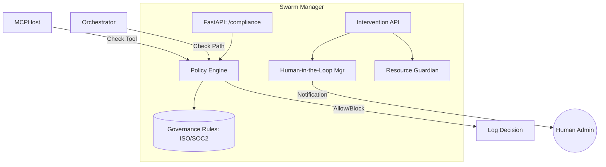

# 🛡️ Swarm Manager ("The Conscience")

The **Swarm Manager** is the governance and compliance layer of Kea. It acts as the system's **Chief Compliance Officer**, enforcing corporate standards, managing human interventions, and ensuring that autonomous swarms operate within safe, audited bounds.

## 📐 Architecture

The Swarm Manager operates as a **Policy Enforcement Point (PEP)**. It intercepts high-risk intents and validates them against the organization's governance rules.

### Component Overview

| Component | Responsibility | Cognitive Role |
| :--- | :--- | :--- |
| **Policy Engine** | Checks operations against ISO/SOC2 standards. | Prefrontal Cortex |
| **Resource Guardian**| Monitors spawn rates and token budgets. | Homeostasis |
| **HITL Manager** | Orchestrates human approval workflows. | Social Awareness |
| **Kill Switch** | Immediate emergency stop for all swarms. | Survival Instinct |

---

## ✨ Key Features

### 1. Multi-Standard Compliance
Includes built-in validators for **ISO 27001**, **SOC2**, and **GDPR**. For example, if an agent attempts to scrape an unencrypted endpoint, the `ISO_27001` policy will block the request and log a high-severity security alert.

### 2. Standard Operating Procedures (SOPs)
Enforces a "Procedural" execution model. Agents cannot execute a high-impact task (like "Publish Report") without first checking off all required SOP gates (e.g., "Peer Review," "Fact Check," "Compliance Sign-off").

### 3. Human-in-the-Loop (HITL)
Provides a structured bridge for human intervention. When a swarm reaches a "Low Confidence" state or a "High Risk" decision node, it enters a `PAUSED` state. The Swarm Manager then alerts a human via the **API Gateway**, allowing for manual guidance or approval.

---

## 📁 Codebase Structure

- **`main.py`**: FastAPI entrypoint hosting the compliance and governance endpoints.
- **`core/`**: The implementation of the oversight and safety logic.
    - `compliance.py`: The rule-based engine for SOC2/ISO/GDPR validation.
    - `supervisor.py`: Logic for managing `QualityGates` and agent revisions.
    - `resource_governor.py`: Throttling and budget enforcement for tokens and compute.
    - `kill_switch.py`: The "Global Stop" protocol for emergency termination.

---

## 🧠 Deep Dive

### 1. Dynamic Quality Gating
The Swarm Manager doesn't just check for security; it checks for **Utility**. The `QualityGate` system uses a specialized **Judge Agent** to score system outputs. If a report's density of evidence is too low or its tone is hallucination-prone, the Manager blocks the synthesis and requests a "Drill Down" from the Worker.

### 2. Adaptive Resource Throttling
Unlike simple rate limiters, the **Resource Guardian** monitors the health of the entire organism. If the **Vault**'s database latency spikes or the **MCP Host** reports VRAM pressure, the Swarm Manager can dynamically lower the `max_concurrency` of all active swarms to prevent a cascade failure.

---
*The Swarm Manager ensures that Project's intelligence is always paired with corporate responsibility.*

