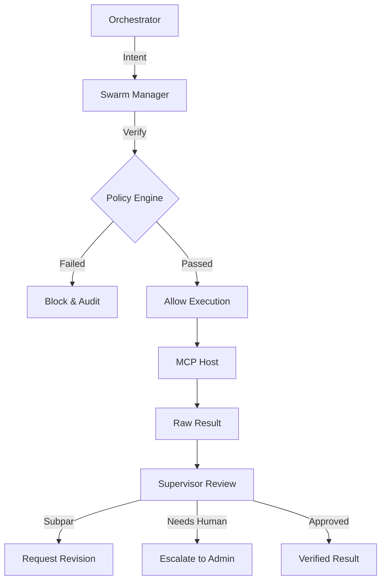

# 🛡️ Swarm Manager ("The Governor")

The **Swarm Manager** is the governance and compliance layer of the Kea v0.4.0 system.

> [!NOTE]
> In the **Brain vs Body** architecture, the Swarm Manager is a "Body" service. It enforces governance and compliance over the **Kea Kernel**'s autonomous operations.

## ✨ Features

- **Multi-Standard Compliance Engine**: Built-in validators for ISO 9001, ISO 27001, SOC2, GDPR, and HIPAA.
- **Procedural Consistency (SOPs)**: Enforces Standard Operating Procedures (SOPs) for critical workflows, ensuring agents follow step-by-step verified paths.
- **Automated Quality Gates**: Implements a `QualityGate` system that scores agent outputs and requests revisions if thresholds are not met.
- **System Resource Guard**: Prevents "System Collapse" by monitoring memory pressure, agent spawn rates, and tool call quotas.
- **Human-in-the-Loop (HITL) Escalation**: Provides a structured mechanism for agents to "pause and escalate" decisions to human administrators.
- **Global Kill-Switch**: A centralized emergency stop protocol to terminate all active agent swarms instantly.

## 📐 Architecture

The Swarm Manager operates as a **Policy Enforcement Point (PEP)**, sitting between the Orchestrator's intent and the MCP Host's execution.

### 🗼 The Oversight Workflow

## 📁 Codebase Structure

- **`main.py`**: FastAPI entrypoint hosting the compliance and governance API.
- **`core/`**: The brain of the governance layer.
    - `compliance.py`: Implementation of the `ComplianceEngine` and ISO/SOC2 rulesets.
    - `supervisor.py`: Manages `QualityGates`, health monitoring, and human escalation.
    - `guards.py`: Logic for rate limiting, memory protection, and tool quotas.
    - `kill_switch.py`: Emergency termination protocols for the entire swarm.
    - `resource_governor.py`: Cost and token usage management.

## 🧠 Deep Dive

### 1. The Compliance Engine
The engine doesn't just log errors; it proactively checks operation context. For example, if a research path involves an external HTTP URL, the `ISO_27001` rule triggers a `27001_https` check. If the URL is insecure, the operation is blocked before the agent can even attempt the connection.

### 2. Procedural Consistency (SOPs)
For complex tasks like "Data Access" or "Standard Research," the manager enforces a `Procedure`. An agent cannot jump to "Execute Research" without first passing through "Query Classification," "Input Validation," and "Security Check." This ensures that even the most advanced autonomous agents remain within predictable, audited bounds.

### 3. Automated Supervision
The `Supervisor` monitors "Team Health." If a swarm's error rate spikes or if agents are becoming "blocked" in a specific tool loop, the Supervisor can trigger a **Load Redistribution** or escalate the entire session to a human, preventing wasted compute and potential hallucinations.

## 📚 Reference

### Compliance Standards Supported

| Standard | Focus Area | Example Check |
|:---------|:-----------|:--------------|
| **ISO 27001** | Info Security | HTTPS Enforcement, Secret Detection |
| **SOC2** | Privacy/Security | Data Classification, Access Logs |
| **GDPR** | Data Privacy | Data Minimization, Consent Verification |
| **ISO 9001** | Quality | Step-by-step SOP verification |

### Governance API

| Endpoint | Method | Description |
|:---------|:-------|:------------|
| `/compliance/check` | `POST` | Validate an operation against specific standards. |
| `/procedures/execute`| `POST` | Start a guided SOP workflow for an agent. |
| `/escalations` | `GET` | List all active human-in-the-loop requests. |
| `/escalations/{id}` | `POST` | Resolve an escalation with a human decision. |
| `/kill` | `POST` | Trigger the global emergency stop. |
| `/health` | `GET` | Service status and resource guard metrics. |
