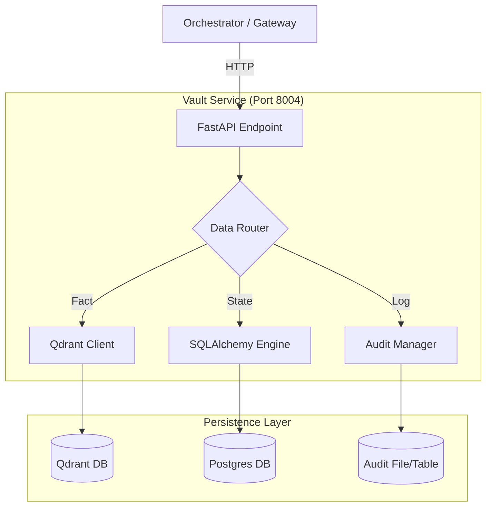

# 💾 Vault Service ("The Memory")

The **Vault Service** is the comprehensive data layer for Kea. It centralizes all persistence, ensuring that the Orchestrator remains stateless and that all actions are audit-logged for compliance.

---

## 🏗️ Architecture Overview

The Vault aggregates three distinct types of storage behind a single API:

1.  **Vector Store (Qdrant)**: Stores "Atomic Facts" for GraphRAG and semantic search.
2.  **Relational DB (Postgres/SQLite)**: Stores Service State, Job History, and Checkpoints.
3.  **Audit Trail (Immutable Log)**: Stores a sequential history of every Agent Action, Tool Call, and Compliance Decision.



---

## 📁 Codebase Structure

| File / Directory | Component | Description |
|:-----------------|:----------|:------------|
| **`main.py`** | **Entry Point** | FastAPI app (Port 8004). Exposes `audit`, `memory`, `state` routes. |
| **`core/`** | **Logic** | Data management logic. |
| ├── `audit_trail.py` | Compliance | Writes structured logs (JSON/DB). |
| ├── `vector_store.py` | Intelligence | Qdrant wrapper for adding/retrieving facts. |
| ├── `checkpointing.py`| State | LangGraph CheckpointSaver implementation for Postgres. |
| └── `models.py` | Schema | SQLAlchemy ORM models. |

---

## 🔌 API Reference

### Audit Logging
**POST** `/audit/logs`

Used by all other services to report actions.

**Request:**
```json
{
  "event_type": "TOOL_EXECUTION",
  "actor": "scraper_agent",
  "action": "scrape_url",
  "details": {"url": "..."}
}
```

### Checkpointing (LangGraph)
**GET** `/state/{thread_id}`
Retrieve the latest state snapshot for a research conversation.

**POST** `/state/{thread_id}`
Save a new state snapshot (delta).

### Memory RAG
**POST** `/memory/search`
Semantic search against the Atomic Facts database.
