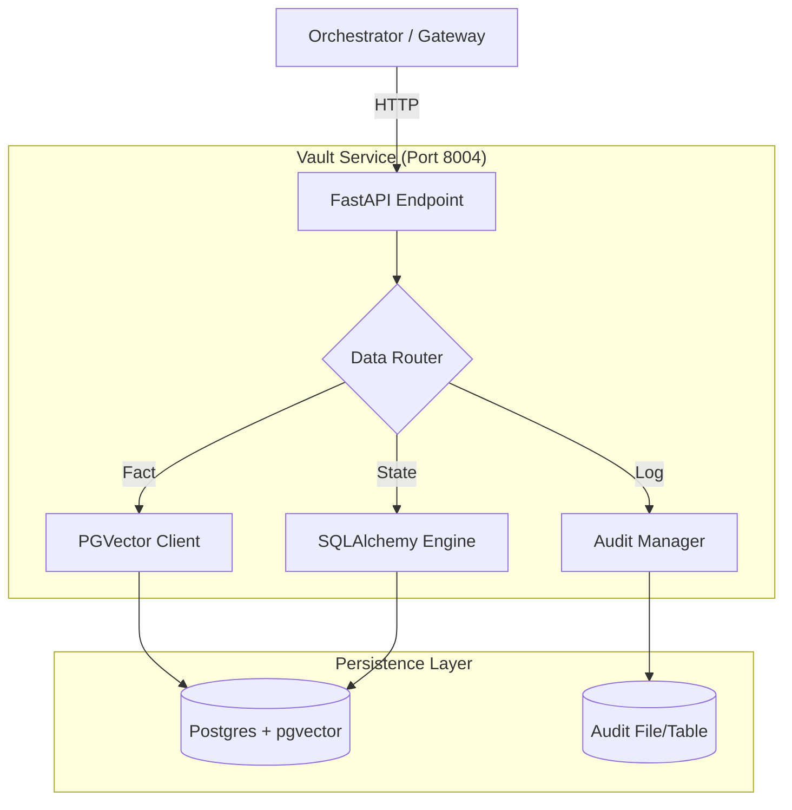

# 💾 Vault Service ("The Memory")

The **Vault Service** is the comprehensive data layer for Kea. It centralizes all persistence, ensuring that the Orchestrator remains stateless and that all actions are audit-logged for compliance.

---

## 🏗️ Architecture Overview

The Vault aggregates three distinct types of storage behind a single API:

1.  **Vector Store (Postgres + pgvector)**: Stores "Atomic Facts" for GraphRAG and semantic search.
2.  **Relational DB (Postgres/SQLite)**: Stores Service State, Job History, and Checkpoints.
3.  **Audit Trail (Immutable Log)**: Stores a sequential history of every Agent Action, Tool Call, and Compliance Decision.



---

## 📁 Codebase Structure

| File / Directory | Component | Description |
|:-----------------|:----------|:------------|
| **`main.py`** | **Entry Point** | FastAPI app (Port 8004). Exposes `audit`, `memory`, `state` routes. |
| **`core/`** | **Logic** | Data management logic. |
| ├── `audit_trail.py` | Compliance | Writes structured logs (JSON/DB). |
| ├── `vector_store.py` | Intelligence | pgvector wrapper for adding/retrieving facts. |
| ├── `checkpointing.py`| State | LangGraph CheckpointSaver implementation for Postgres. |
| └── `models.py` | Schema | SQLAlchemy ORM models. |

---

## 🔌 API Reference

### Audit Logging
**POST** `/audit/logs`

Used by all other services to report actions.

**Request:**
```json
{
  "event_type": "TOOL_EXECUTION",
  "actor": "scraper_agent",
  "action": "scrape_url",
  "details": {"url": "..."}
}
```

### Checkpointing (LangGraph)
**GET** `/state/{thread_id}`
Retrieve the latest state snapshot for a research conversation.

**POST** `/state/{thread_id}`
Save a new state snapshot (delta).

### Memory RAG
**POST** `/memory/search`
Semantic search against the Atomic Facts database.

---

## 🏗️ Technical Deep Dive

### 1. Immutable Audit Integrity (`core/audit_trail.py`)
The Vault implements a "Chain of Custody" for every action:
- **Cryptographic Checksums**: Every log entry (e.g., `TOOL_CALLED`) includes a SHA-256 hash of its contents (actor, timestamp, payload, parent_id).
- **Audit Verification**: The system can verify the integrity of a session trace by re-computing hashes, making it suitable for SOC2/ISO compliance.
- **Parent-Child Tracing**: Uses `parent_id` to link recursive sub-orchestrations back to the original user query.

### 2. High-Fidelity Graph Checkpointing (`core/checkpointing.py`)
Unlike standard state stores, the Vault stores the **entire LangGraph snapshot**:
- **State Time-Travel**: Every "turn" in the research loop is saved. Chronos can pull these snapshots to "rewind" the brain to a previous state for debugging.
- **Fact Deduplication**: Before storing a new Atomic Fact in the Vector Store, the Vault performs a semantic similarity check to prevent "Knowledge Bloat".
