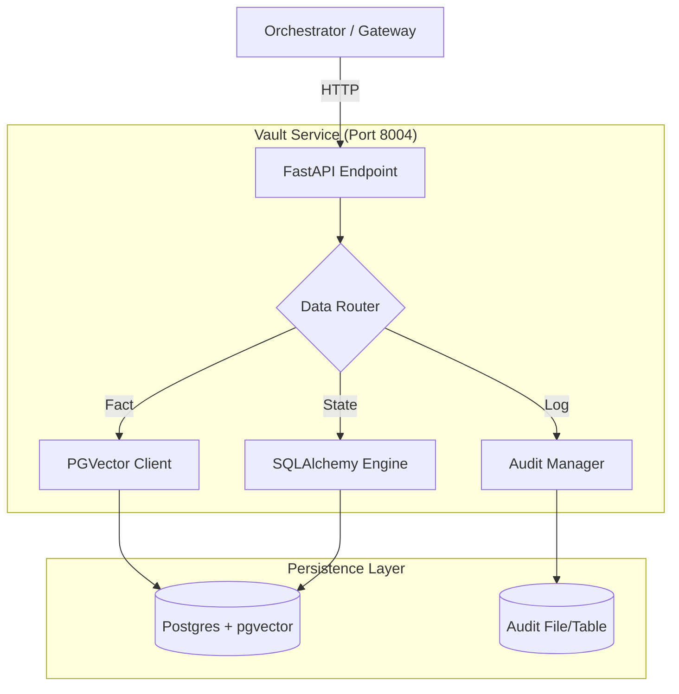
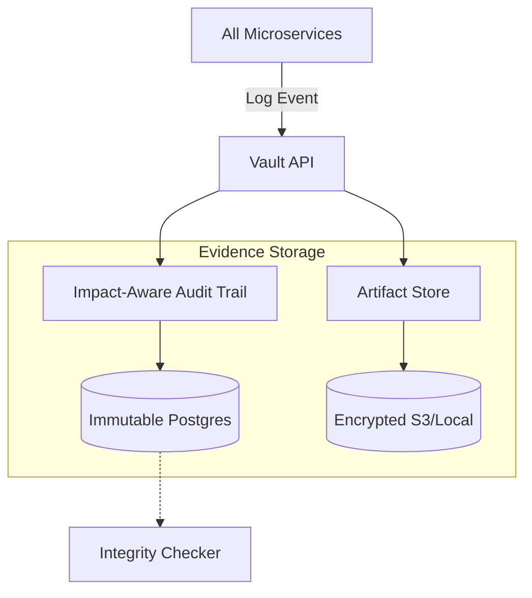

# 💾 Vault Service ("The Memory")

The **Vault Service** is the comprehensive data layer for Kea. It centralizes all persistence, ensuring that the Orchestrator remains stateless and that all actions are audit-logged for compliance.

---

## 🏗️ Architecture Overview

The Vault aggregates three distinct types of storage behind a single API:

1.  **Vector Store (Postgres + pgvector)**: Stores "Atomic Facts" for GraphRAG and semantic search.
2.  **Relational DB (Postgres/SQLite)**: Stores Service State, Job History, and Checkpoints.
3.  **Audit Trail (Immutable Log)**: Stores a sequential history of every Agent Action, Tool Call, and Compliance Decision.

---

## 📁 Codebase Structure

| File / Directory | Component | Description |
|:-----------------|:----------|:------------|
| **`main.py`** | **Entry Point** | FastAPI app (Port 8004). Exposes `audit`, `memory`, `state` routes. |
| **`core/`** | **Logic** | Data management logic. |
| ├── `audit_trail.py` | Compliance | Interface for writing structured logs. |
| ├── `postgres_audit.py`| Storage | **NEW**: Postgres-specific implementation of the audit log. |
| ├── `postgres_store.py`| Persistence | **NEW**: Robust Postgres client for structured data. |
| ├── `vector_store.py` | Intelligence | Interface for pgvector operations. |
| └── `checkpointing.py`| State | LangGraph CheckpointSaver implementation logic. |

---

## 🔌 API Reference

### Audit Logging
| Endpoint | Method | Description |
|:---------|:-------|:------------|
| `/audit/logs` | `POST` | Record a new audit event. |
| `/audit/logs` | `GET` | Query historical logs with filters. |
| `/health` | `GET` | Basic service health check. |

---

## 🏗️ Technical Deep Dive

### 1. Immutable Audit Integrity (`core/audit_trail.py`)
The Vault implements a **Hardened Evidence Architecture** to provide a "Memory of Record" for all autonomous actions:

1.  **Immutable Audit Trail**: Based on a **WORM (Write Once, Read Many)** storage pattern. Once an event is logged, it cannot be modified or deleted by systemic agents.
2.  **Audit Persistence Layer**: Uses a high-integrity Postgres backend with schema-level constraints to prevent record tampering.
3.  **Encrypted Artifact Store**: Manages binary research artifacts (PDFs, Parquet files) using AES-256 encryption at rest.

---

## ✨ Features & Audit Integrity

### 📜 The Impact-Aware Audit Trail
Every entry in the Vault is more than just a log; it is a **Structured Evidence Bundle**:
- **Actor/Action/Resource**: Full trace of *who* did *what* to *which* data.
- **Session Correlation**: Every event is tied to a `session_id` or `job_id` for end-to-end timeline reconstruction.
- **Impact Grading**: Events are tagged by severity (e.g., `DATA_ACCESS`, `SYSTEM_RECOVERY`) to facilitate high-speed compliance reporting.

### 🛡️ Storage Governance
- **Deletion Gating**: The Vault API requires a multi-signature equivalent (internal specialized keys) to perform data pruning.
- **Heartbeat Monitoring**: Constantly verifies the connection to the storage backend to ensure zero-loss logging.
- **Cryptographic Provenance**: Plans for blockchain-backed hashing of audit headers to ensure third-party verifiable integrity.

### 🧩 Artifact Lifecycle Management
- **Automatic Versioning**: Every artifact uploaded is versioned to prevent "State Overwrite" errors during research.
- **Streaming Retrieval**: Efficiently handles multi-GB research datasets via direct-to-S3 signed URLs or chunked local streams.

### 2. High-Fidelity Graph Checkpointing (`core/checkpointing.py`)
Unlike standard state stores, the Vault stores the **entire LangGraph snapshot**:
- **State Time-Travel**: Every "turn" in the research loop is saved. Chronos can pull these snapshots to "rewind" the brain to a previous state for debugging.
- **Fact Deduplication**: Before storing a new Atomic Fact in the Vector Store, the Vault performs a semantic similarity check to prevent "Knowledge Bloat".
