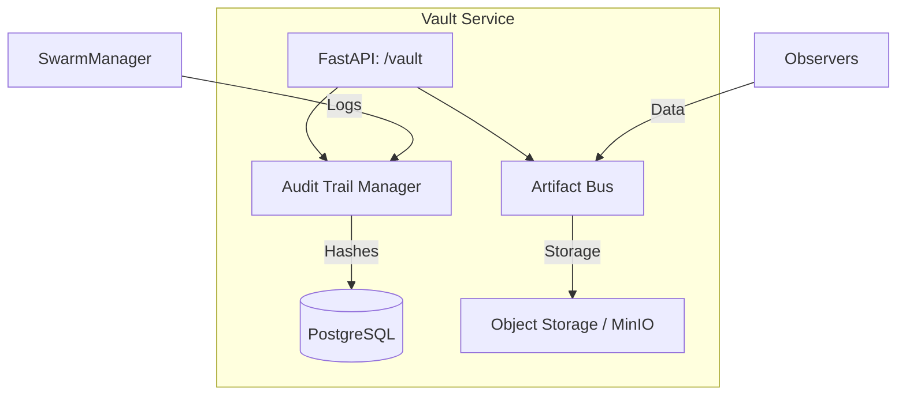

# 🏦 The Vault ("The Memory")

The **Vault Service** is the persistence and data transport layer of the Kea v0.4.0 system. It serves as the system's **Long-Term Memory** and **Immutable Audit Trail**.

## 📐 Architecture

The Vault provides a unified interface for system persistence needs: **Audit Logs** and **System Artifacts**.

### Component Overview

| Component | Responsibility | Cognitive Role |
| :--- | :--- | :--- |
| **Audit Trail** | Immutable logging of every system decision. | Procedural Memory |
| **Artifact Bus** | High-speed transport for system files. | Sensory Buffet |
| **Integrity Mgr** | Cryptographic verification of log entries. | Conscience |

---

## ✨ Key Features

### 1. Immutable Audit Trail
The Vault calculates a SHA-256 checksum for every decision made by the system. These logs are "Chained" (each entry contains the hash of the previous one), creating a mathematically verifiable record of system provenance for regulated industries.

### 2. The Artifact Bus (Architecture)
While the Vault doesn't have a file named `artifact_bus.py`, the **Vector Store** and **Postgres Store** act together to serve this function. Heavy artifacts are stored as `Documents` in the vector database, allowing agents to retrieve massive files via semantic search rather than downloading them locally.

---

## 📁 Codebase Structure

- **`main.py`**: FastAPI entrypoint hosting the persistence and session APIs.
- **`core/`**: The implementation of the immutable storage engines.
- **`audit_trail.py`**: Logic for `AuditEntry` creation and hash-chaining.
- **`postgres_store.py`**: General-purpose relational storage management.
- **`vector_store.py`**: Interface for high-dimensional semantic search.

---

## 🧠 Deep Dive

### 1. The "Black Box" Principle
The Vault is designed as a "Write-Once, Read-Many" system for audit data. Once an entry is committed, it cannot be modified or deleted via the API. This ensures that even if an agent "hallucinates" or a service is compromised, the history of what actually happened remains pristine.

---
*The Vault ensures that no insight is lost and every decision is accountable.*
