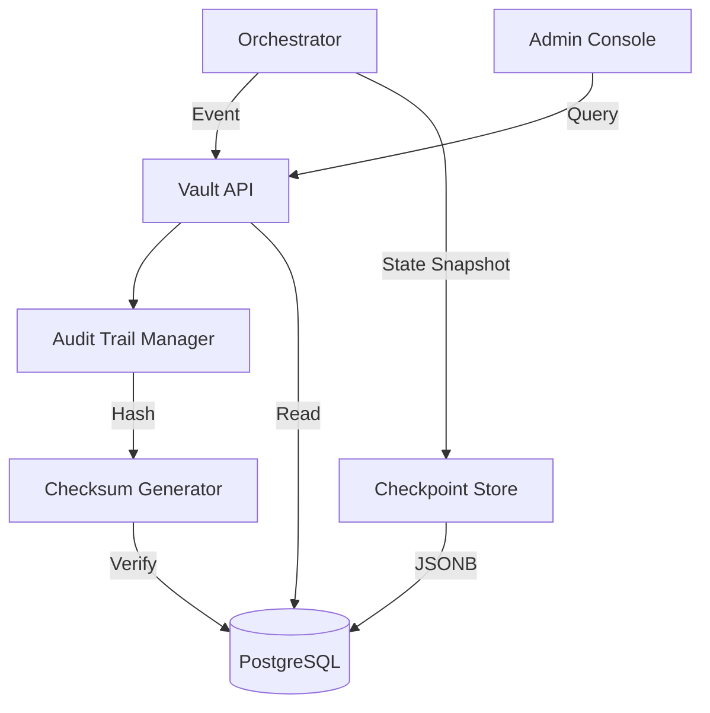

# 🏦 The Vault ("The Black Box")

The **Vault Service** is the immutable persistence and audit layer of the Kea system. It acts as the system's "Black Box" recorder, ensuring that every cognitive step, tool execution, and compliance decision is logged with cryptographic integrity. It also manages state checkpointing for the Orchestrator's LangGraph.

## ✨ Features

- **Immutable Audit Trail**: Logs all system events with SHA-256 checksums to prevent record tampering.
- **LangGraph Checkpointing**: Persists the state of research graphs to PostgreSQL, enabling seamless recovery after system restarts or crashes.
- **Cryptographic Integrity**: Each audit entry is hashed with its predecessor's metadata, creating a verifiable chain of custody for research findings.
- **High-Fidelity "OODA" Logging**: Specifically captures Observe, Orient, Decide, and Act phases for every agent decision.
- **Automatic Auditing Decorator**: Easy-to-use `@audited` utility for developers to wrap sensitive functions with persistence logic.
- **PostgreSQL Backend**: Primary storage using PostgreSQL with pgvector extension for semantic search and JSONB for flexible state storage.

---

## 📐 Architecture

The Vault sits at the bottom of the stack, providing a "Source of Truth" for all other services.

### 🗼 The Persistence Flow

---

## 📁 Codebase Structure

- **`main.py`**: FastAPI entrypoint hosting the audit and checkpointing API.
- **`core/`**: The implementation of the persistence engines.
    - `audit_trail.py`: Core logic for managing `AuditEntry` objects and checksum verification.
    - `checkpointing.py`: Implementation of the PostgreSQL-backed state store for LangGraph.
    - `postgres_audit.py`: Direct database interactions for the audit trail.
    - `postgres_store.py`: General-purpose relational storage management.
    - `vector_store.py`: Base implementation for high-dimensional fact storage used by the RAG service.

---

## 🧠 Deep Dive

### 1. Immutable Audit Entries
The `AuditEntry` is the unit of accountability in Kea. Beyond standard fields (Action, Actor, Resource), it calculates a unique `checksum` of its own contents. Any attempt to modify a log entry post-creation will invalidate this checksum, providing a mathematically verifiable audit trail for regulated industries (Finance, Legal, Healthcare).

### 2. LangGraph State Checkpointing
The `CheckpointStore` allows Kea to handle long-running research jobs (minutes to hours). Every time the Orchestrator moves between nodes (e.g., from Planner to Researcher), a state snapshot is saved as a `JSONB` blob in the `graph_checkpoints` table. If the system fails, the Orchestrator can reload the `latest` checkpoint and resume exactly where it left off.

### 3. Automatic "Chain of Thought" Capture
By using the `@audited` decorator, the system captures not just the *inputs* and *outputs* of functions, but the entire "Chain of Thought" (CoT). This data is critical for fine-tuning future models and performing forensic analysis on agent hallucinations.

---

## 📚 Reference

### Audit Event Types

| Event Type | Description | Trigger Point |
|:-----------|:------------|:--------------|
| `TOOL_CALLED` | Execution of an MCP tool | Researcher Node |
| `DECISION_MADE` | Agent selecting a specific research path | Planner Node |
| `SECURITY_CHECK` | Compliance engine validation | Swarm Manager |
| `APPROVAL_GRANTED`| Human sign-off on high-risk task | API Gateway |

### API Interface

| Endpoint | Method | Description |
|:---------|:-------|:------------|
| `/audit/logs` | `POST` | Manually log a custom audit event. |
| `/audit/logs` | `GET` | Query and filter audit history. |
| `/checkpoints/{job_id}` | `GET` | Retrieve the state of a specific research job. |
| `/health` | `GET` | Service status and DB connection pool health. |
