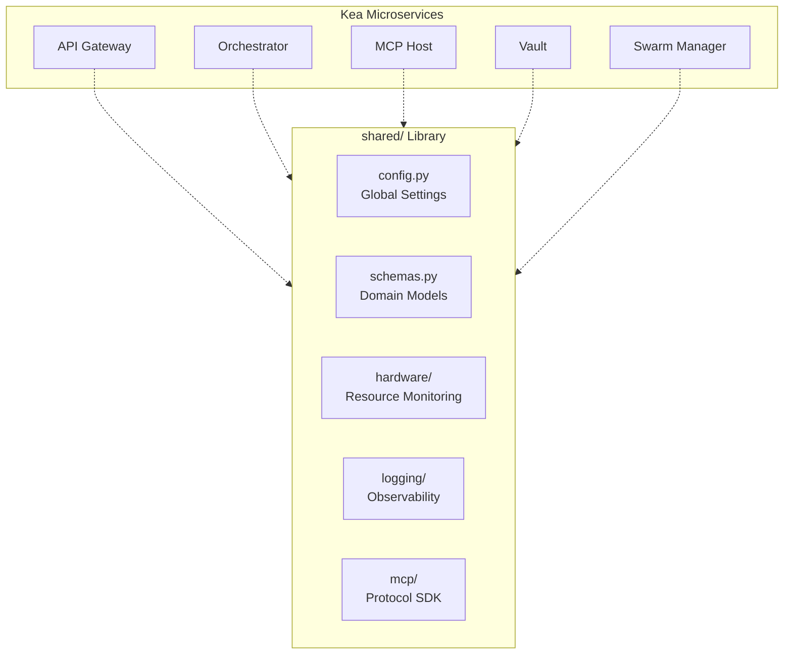

# 📚 Shared Libraries ("The Foundation")

The `shared/` directory is the **Standard Library** of the Kea system. It contains the core primitives, data schemas, and infrastructure abstractions that ensure consistency and interoperability across all microservices. It is the common substrate upon which the entire "Fractal Corp" architecture is built.

## ✨ Features

- **Unified Configuration**: Strongly-typed settings using Pydantic `BaseSettings` with JIT spawning controls and hardware-aware defaults.
- **Rich Domain Schemas**: Canonical models for `ResearchState`, `AtomicFact`, and a sophisticated `ToolOutput` container for n8n-style data chaining.
- **Hardware-Aware Adaptive Execution**: Automated system profiling (CPU, RAM, GPU) to optimize worker counts and batch sizes in real-world environments (Colab, Kaggle, Local).
- **Zero-Trust Structured Logging**: OpenTelemetry-ready JSON logging with trace correlation across service boundaries.
- **LLM & MCP Abstractions**: Standardized interfaces for multi-provider LLM access (OpenRouter) and Model Context Protocol (MCP) clients/servers.
- **Service Discovery**: Centralized registry for inter-service communication URLs and port mapping.

---

## 📐 Architecture

The Shared Library acts as the "Glue" and "Substrate" for the distributed system, preventing logic drift between services.

### 🗼 The Shared Substrate

---

## 📁 Codebase Structure

- **`config.py`**: Centralized configuration management using environment variables and YAML.
- **`schemas.py`**: The "Book of Truth" for all inter-service data contracts.
- **`service_registry.py`**: Maps service names to URLs and ports.
- **`hardware/`**: Hardware detection, resource pressure monitoring, and optimal execution strategy calculation.
- **`logging/`**: Structured JSON logging, OpenTelemetry tracing, and performance metrics.
- **`mcp/`**: Shared implementation of the Model Context Protocol (Client, Server, Transport, Router).
- **`llm/`**: Abstraction layer for LLM providers with built-in retry logic and token tracking.
- **`database/`**: Shared connection pool management and database lifecycle utilities.

---

## 🧠 Deep Dive

### 1. Hardware-Aware Scaling (`hardware/detector.py`)
Kea is designed to run anywhere. The `HardwareProfile` detected at startup determines the `optimal_workers()` formula. For example, if it detects only 4GB of RAM (common in standard Colab), it limits concurrent agent swarms to prevent OOM (Out-of-Memory) crashes, while on a 128-core VPS, it scales up to 8+ parallel workers automatically.

### 2. The `ToolOutput` Container (`schemas.py`)
To enable complex agent chains (n8n-style), the `ToolOutput` model supports more than just text. It can carry structured `DataPayload`s, `FileReference`s for large datasets, and even `next_input` suggestions. This allows a "Search" tool to pass a list of URLs directly to a "Scraper" tool without the LLM having to manually parse and re-format the data in between.

### 3. Trace Correlation (`logging/structured.py`)
By using a global `ContextVar`, the logging system automatically injects `trace_id` and `span_id` into every log line, even when crossing service boundaries via HTTP. This ensures that a single user query can be traced from the Gateway, through the Orchestrator, into tools executed on the MCP Host, and finally to the persistence layer in the Vault.

---

## 📚 Reference

### Core Primitive Reference

| Class | Description | Key Fields |
|:------|:------------|:-----------|
| `ResearchState` | The LangGraph state object. | `job_id`, `facts`, `sub_queries`, `report` |
| `AtomicFact` | High-fidelity data point. | `entity`, `attribute`, `value`, `confidence` |
| `ToolOutput` | Rich n8n-style result. | `text`, `data`, `files`, `next_input` |
| `HardwareProfile`| System capability map. | `cpu_threads`, `ram_total_gb`, `gpu_count` |

### Service Port Registry

| Service | Default Port | Environment Variable Override |
|:--------|:-------------|:------------------------------|
| Gateway | 8000 | `SERVICE_URL_GATEWAY` |
| Orchestrator | 8001 | `SERVICE_URL_ORCHESTRATOR` |
| MCP Host | 8002 | `SERVICE_URL_MCP_HOST` |
| RAG Service | 8003 | `SERVICE_URL_RAG_SERVICE` |
| Vault | 8004 | `SERVICE_URL_VAULT` |
| Swarm Manager| 8005 | `SERVICE_URL_SWARM_MANAGER` |
| Chronos | 8006 | `SERVICE_URL_CHRONOS` |
