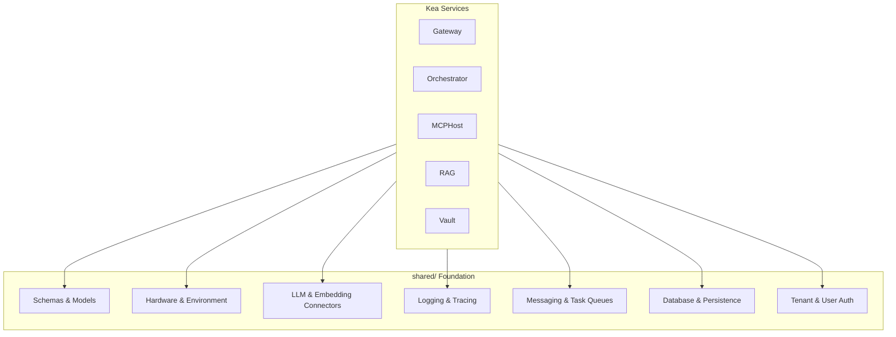

# 📚 Shared Libraries ("The Foundation")

The `shared/` directory is the **Standard Library** of the Kea v0.4.0 system. It contains the core primitives, data schemas, and infrastructure abstractions that ensure consistency and interoperability across all microservices.

## 📐 Architecture

The Shared Library acts as the "Standard Substrate". It provides a common language for both the **Brain** (Reasoning) and the **Body** (Execution).

### Component Overview

| Module | Responsibility | Key File |
| :--- | :--- | :--- |
| **Schemas** | Canonical Pydantic models for the entire system. | `schemas.py` |
| **Hardware** | Real-time system profiling and adaptive scaling. | `hardware/` |
| **LLM Interface** | Standardized multi-provider LLM connector. | `llm/` |
| **MCP** | Model Context Protocol implementation and utilities. | `mcp/` |
| **Database** | Asynchronous PostgreSQL connection pooling (`asyncpg`). | `database/` |
| **Logging** | Structured JSON logging with trace correlation. | `logging/` |
| **Tenants** | Multi-tenancy isolation and compliance context. | `tenants/` |
| **Users** | Identity, RBAC, and API key management. | `users/` |

---

## ✨ Key Features

### 1. Hardware-Aware Adaptive Execution (`hardware/`)
Project doesn't just run; it *adapts*. The `HardwareDetector` profiles the system (CPU cores, RAM availability, VRAM) on startup. This profile is used to calculate the `optimal_worker_count` for MCP servers and execution swarms, preventing system OOMs on limited hardware while maximizing throughput on enterprise-grade clusters.

### 2. Rich Domain Schemas (`schemas.py`)
Centralized Pydantic models ensure that an `ExecutionState` produced by the **Orchestrator** is perfectly understood by the **Vault** and the **Gateway**. It includes models for:
- **ExecutionState**: The global context object for a job.
- **AtomicInsight**: A single, cited piece of evidence.
- **ToolOutput**: Container for text, data, and files from MCP tools.

### 3. Unified Discovery & Routing
The `service_registry.py` and `environment.py` modules manage how services find each other. They support multiple environments (Local, Docker, K8s) and ensure that `SERVICE_URL_VAULT` is always pointing to the right instance without hardcoding.

### 4. Enterprise-Grade Persistence (`database/`)
A centralized connection pooling system based on `asyncpg`. It provides health monitoring, singleton-per-loop lifecycle management, and fail-safe startup logic.

---

## 📁 Component Details

### `schemas.py`
The "Single Source of Truth." If you want to know what a "Job" or an "Artifact" looks like, this is the first place to look.

### `config.py`
Manages strongly-typed settings using `pydantic-settings`. It supports `.env` files and environment variable overrides for every parameter in the system.

### `hardware/`
Contains the logic for detecting available resources. It provides decorators and utilities to throttle execution based on system pressure.

### `llm/` & `embedding/`
Abstract away the differences between OpenAI, Anthropic, Voyage, and Hugging Face. They handle retry logic, rate limits, and cost tracking.

### `mcp/`
Implementation of the Model Context Protocol. It includes schema inferrers and registry logic used by the MCP Host.

### `logging/`
Advanced structured logging using `structlog`. It ensures that every log entry carries a `trace_id` so we can follow a single request across 7 different services.

### `conversations/` & `sessions/`
Manage the lifecycle of user interactions. `conversations/` handles message persistence and vector-indexed history, while `sessions/` manages ephemeral state and JWT/Cookie authentication.

### `tenants/` & `users/`
The security backbone. `tenants/` ensures strict data partitioning between organizations, while `users/` handles RBAC, profiles, and secure API keys.

---
*The shared library ensures that Kea remains a single, cohesive organism rather than a collection of disjointed scripts.*

