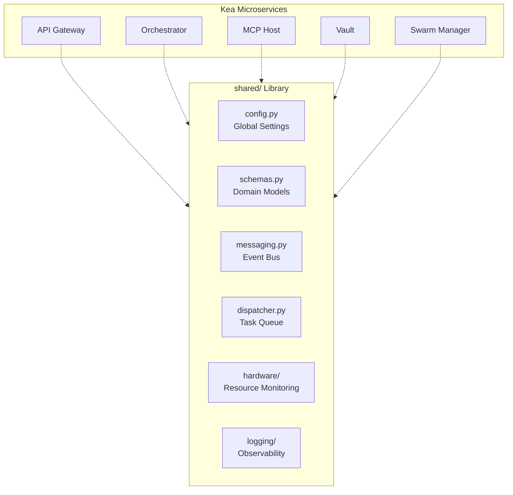

# 📚 Shared Libraries ("The Foundation")

The `shared/` directory is the **Standard Library** of the Kea v4.0 system. It contains the core primitives, data schemas, and infrastructure abstractions that ensure consistency and interoperability across all microservices. It is the common substrate upon which the entire "Fractal Corp" architecture is built.

## ✨ Features

- **Unified Configuration**: Strongly-typed settings using Pydantic `BaseSettings` with JIT spawning controls and hardware-aware defaults.
- **Rich Domain Schemas**: Canonical models for `ResearchState`, `AtomicFact`, and a sophisticated `ToolOutput` container for n8n-style data chaining.
- **Messaging System**: Async `MessageBus` (`messaging.py`) for inter-agent communication (Request/Response, Broadcast).
- **Task Dispatcher**: Persistent "Fire and Forget" task queue (`dispatcher.py`) backed by PostgreSQL for managing massive batches of micro-tasks.
- **Hardware-Aware Adaptive Execution**: Automated system profiling (CPU, RAM, GPU) to optimize worker counts and batch sizes.
- **Zero-Trust Structured Logging**: OpenTelemetry-ready JSON logging with trace correlation across service boundaries.
- **LLM & MCP Abstractions**: Standardized interfaces for multi-provider LLM access and Model Context Protocol clients.

## 📐 Architecture

The Shared Library acts as the "Glue" and "Substrate" for the distributed system.

## 📁 Codebase Structure

- **`config.py`**: Centralized configuration management using pydantic-settings.
- **`schemas.py`**: Canonical data models for research, jobs, and tools.
- **`environment.py`**: Dynamic environment detection and mode management (Dev, Prod, Test).
- **`hardware/`**: Real-time hardware profiling and adaptive execution strategies.
- **`embedding/`**: Abstraction layer for vector embeddings (OpenAI, Hugging Face, Voyage).
- **`messaging.py`**: Implementation of the intra-service Message Bus.
- **`dispatcher.py`**: SQL-backed task queue for managing massive parallel batches.
- **`logging/`**: Structured JSON logging and OpenTelemetry metrics integration.
- **`mcp/`**: Core protocol implementation for Model Context Protocol.
- **`llm/`**: Standardized interface for multi-provider LLM access.

## 🧠 Deep Dive

### 1. Hardware-Aware Adaptive Execution (`hardware/`)
Kea doesn't just run; it *adapts*. The `HardwareDetector` profiles the system (CPU cores, RAM availability, VRAM) on startup. This profile is used to calculate the `optimal_worker_count` for MCP servers and research swarms, preventing system OOMs on limited hardware while maximizing throughput on enterprise-grade clusters.

### 2. The Task Dispatcher (`dispatcher.py`)
For high-scale research (e.g., "Analyze 1,000 documents"), the system avoids blocking. It Enqueues `ExecutionTask` objects into the PostgreSQL-backed dispatcher. These tasks are then picked up by background **Workers**, with their progress and results tracked persistently.

### 3. Environment & Mode Management (`environment.py`)
The system supports multiple modes of operation seamlessly (Dev, Production, Staging). The `EnvironmentConfig` handles secret loading, service URL resolution, and logging levels dynamically based on the `ENV` variable.

## 📚 Reference

### Core Primitive Reference

| Class | Description | Key Fields |
|:------|:------------|:-----------|
| `ResearchState` | The LangGraph state object. | `job_id`, `facts`, `sub_queries`, `report` |
| `AtomicFact` | High-fidelity data point. | `entity`, `attribute`, `value`, `confidence` |
| `Message` | Inter-agent communication. | `from_agent`, `to_agent`, `content`, `type` |
| `ToolOutput` | Rich n8n-style result. | `text`, `data`, `files`, `next_input` |

### Service Port Registry

| Service | Default Port | Environment Variable Override |
|:--------|:-------------|:------------------------------|
| Gateway | 8000 | `SERVICE_URL_GATEWAY` |
| Orchestrator | 8001 | `SERVICE_URL_ORCHESTRATOR` |
| MCP Host | 8002 | `SERVICE_URL_MCP_HOST` |
| RAG Service | 8003 | `SERVICE_URL_RAG_SERVICE` |
| Vault | 8004 | `SERVICE_URL_VAULT` |
| Swarm Manager| 8005 | `SERVICE_URL_SWARM_MANAGER` |
