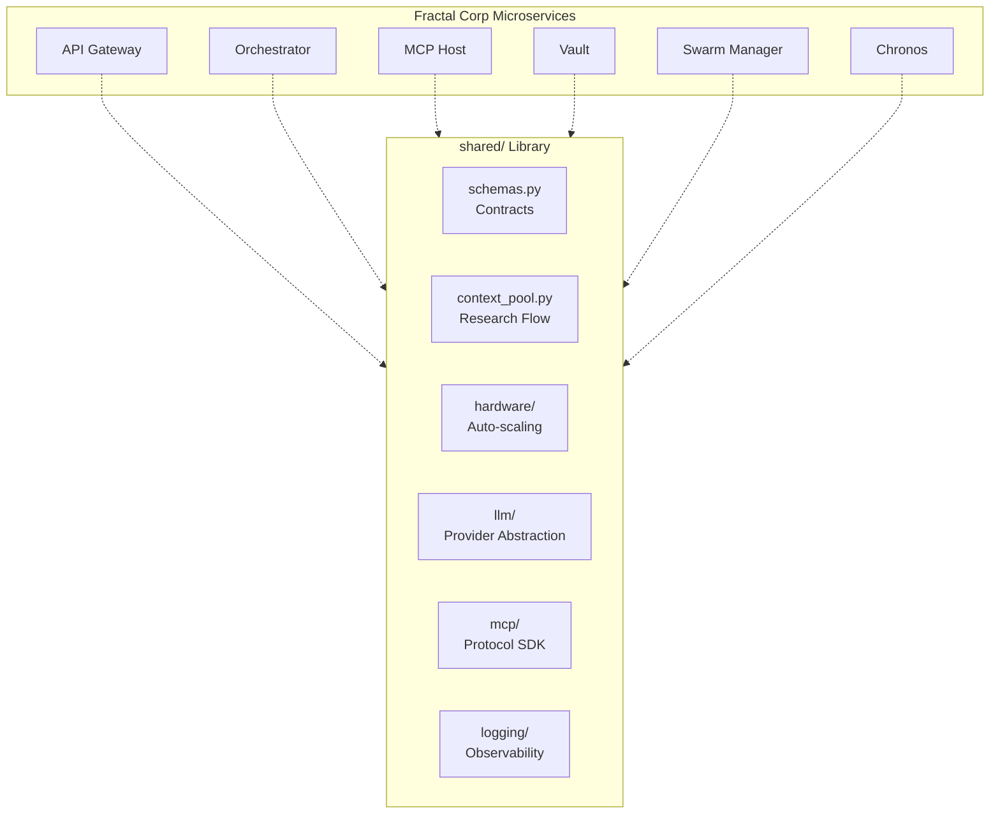

# 📚 Shared Libraries ("The Foundation")

The `shared/` directory is the **Standard Library** of the Kea system. It contains the core primitives, data schemas, and infrastructure abstractions that ensure consistency and interoperability across all microservices in the Fractal Corp architecture.

---

## 🏗️ Architecture Role

The Shared Library acts as the "Glue" and "Substrate" for the distributed system. By centralizing core logic, it prevents drift between services and enables a unified development experience.

1.  **Contract Management**: Canonical Pydantic schemas for inter-service communication.
2.  **Cognitive State Flow**: Shared memory primitives (`TaskContextPool`) for parallel research.
3.  **Cross-Platform Adaptation**: Hardware-aware execution strategies.
4.  **Observer Integrity**: Unified tracing and structured logging.

---

## 📁 Codebase Structure & Reference

| Module / File | Component | Description | Key Classes/Functions |
|:--------------|:----------|:------------|:----------------------|
| **`schemas.py`** | **Contracts** | **Critical**. Truth for all API and Graph contracts. | `ResearchState`, `AtomicFact`, `JobRequest` |
| **`context_pool.py`** | **Memory** | Shared clipboard for parallel agent workers. | `TaskContextPool`, `ExtractionStrategy` |
| **`hardware/`** | **Infrastructure**| Hardware detection and resource monitoring. | `detect_hardware()`, `HardwareProfile` |
| **`llm/`** | **Intelligence** | Unified interface for 20+ LLM providers. | `LLMProvider`, `OpenRouter`, `LLMConfig` |
| **`mcp/`** | **Protocol** | Model Context Protocol SDK implementation. | `MCPClient`, `ToolRouter`, `ToolIndex` |
| **`logging/`** | **Observability**| Tracing, business metrics, and structured logs. | `get_logger()`, `trace_function`, `record_tool_call` |
| **`database/`** | **Persistence** | Database connection pooling and health checks. | `DatabasePool`, `DatabaseConfig` |
| **`tools/`** | **Execution** | JIT tool loading and process isolation. | `JITToolLoader`, `ToolIsolator` |
| **`tenants/`** | **Security** | Multi-tenancy and data isolation logic. | `TenantContext`, `ResourcePrefix` |
| **`messaging.py`** | **Event Bus** | Inter-service message passing (Sync/Async). | `Message`, `MessageBus` |
| **`config.py`** | **Environment** | Strongly-typed configuration management. | `Settings`, `get_settings()` |

---

## 🔬 Deep Dive: Core Mechanics

### 1. Research State Flow (`TaskContextPool`)
Used by the `Researcher` node to manage data flow between 50+ parallel scrapers.
- **URL Pooling**: Deduplicates and prioritizes URLs discovered during crawling.
- **Fact Accumulation**: Thread-safe harvesting of atomic data points before final synthesis.
- **Data Chaining**: Automatically passes context from an "Overview" tool to a "Deep Dive" tool.

### 2. Hardware-Aware Dispatching (`hardware/`)
Ensures Kea runs efficiently on everything from a Raspberry Pi to a H100 GPU cluster.
- **Profile Detection**: Probes CPU cores, RAM bandwidth, and GPU VRAM.
- **Optimal Scaling**: Provides the `optimal_workers()` formula used by the Orchestrator to decide how many agents to spawn without crashing the host.

### 3. JIT Tool Evolution (`tools/jit_loader.py`)
Enables "Self-Healing" tool execution.
- **Dependency Sandboxing**: Uses `uv` to dynamically install exact package versions (e.g., `playwright`, `scikit-learn`) for ephemeral tool processes.
- **Security Whitelisting**: Intercepts `pip/uv` calls to prevent execution of malicious code.

---

## 🔌 Core Type Reference

### Research State primitives
| Class | Description | Fields |
|:------|:------------|:-------|
| `ResearchState` | The LangGraph state object. | `job_id`, `facts`, `hypotheses`, `report`, `path` |
| `AtomicFact` | Verification unit. | `entity`, `attribute`, `value`, `confidence_score` |
| `QueryPath` | Enum for routing. | `A (Memory)`, `B (Lab)`, `C (Synthesis)`, `D (Deep)` |

### Transport & API
| Class | Description | Fields |
|:------|:------------|:-------|
| `JobRequest` | Input for `/jobs`. | `query`, `job_type`, `depth`, `domain_hints` |
| `NodeOutput` | Standardized log entry. | `trace_id`, `source_node`, `content`, `timestamp` |
| `ToolInvocation` | Execution audit log. | `tool_name`, `arguments`, `result`, `is_error` |
