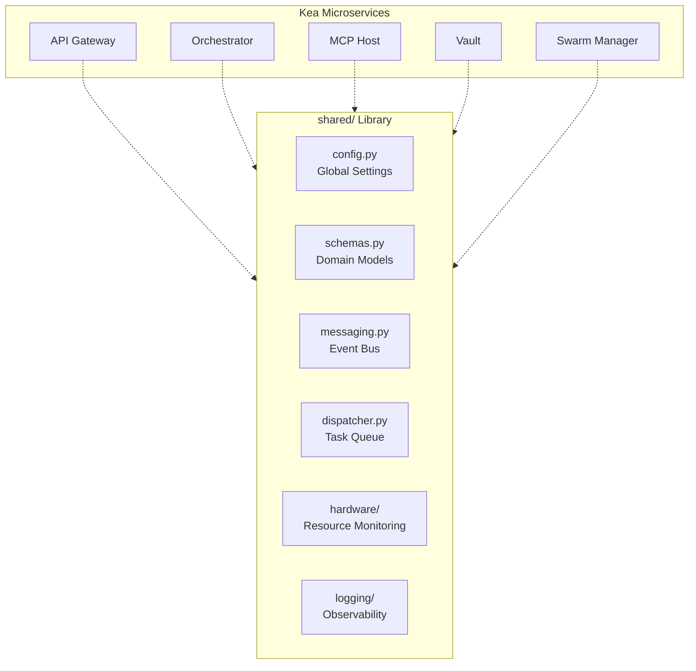

# 📚 Shared Libraries ("The Foundation")

The `shared/` directory is the **Standard Library** of the Kea v4.0 system. It contains the core primitives, data schemas, and infrastructure abstractions that ensure consistency and interoperability across all microservices. It is the common substrate upon which the entire "Fractal Corp" architecture is built.

## ✨ Features

- **Unified Configuration**: Strongly-typed settings using Pydantic `BaseSettings` with JIT spawning controls and hardware-aware defaults.
- **Rich Domain Schemas**: Canonical models for `ResearchState`, `AtomicFact`, and a sophisticated `ToolOutput` container for n8n-style data chaining.
- **Messaging System**: Async `MessageBus` (`messaging.py`) for inter-agent communication (Request/Response, Broadcast).
- **Task Dispatcher**: Persistent "Fire and Forget" task queue (`dispatcher.py`) backed by PostgreSQL for managing massive batches of micro-tasks.
- **Hardware-Aware Adaptive Execution**: Automated system profiling (CPU, RAM, GPU) to optimize worker counts and batch sizes.
- **Zero-Trust Structured Logging**: OpenTelemetry-ready JSON logging with trace correlation across service boundaries.
- **LLM & MCP Abstractions**: Standardized interfaces for multi-provider LLM access and Model Context Protocol clients.

## 📐 Architecture

The Shared Library acts as the "Glue" and "Substrate" for the distributed system.

## 📁 Codebase Structure

- **`config.py`**: Centralized configuration management using environment variables and YAML.
- **`schemas.py`**: The "Book of Truth" for all inter-service data contracts.
- **`messaging.py`**: Implementation of the Agent Message Bus.
- **`dispatcher.py`**: Persistent task tracking and batch management.
- **`service_registry.py`**: Maps service names to URLs and ports.
- **`hardware/`**: Hardware detection, resource pressure monitoring, and optimal execution strategy calculation.
- **`logging/`**: Structured JSON logging, OpenTelemetry tracing, and performance metrics.
- **`mcp/`**: Shared implementation of the Model Context Protocol (Client, Server, Transport, Router).
- **`llm/`**: Abstraction layer for LLM providers with built-in retry logic and token tracking.
- **`database/`**: Shared connection pool management and database lifecycle utilities.
- **`context_pool.py`**: Management of shared memory segments for agent swarms.

## 🧠 Deep Dive

### 1. The Message Bus (`messaging.py`)
To enable the "Fractal Corp" interaction, agents need to talk. The `MessageBus` allows an agent to `request` information from another, `broadcast` an update to its department, or send an `urgent` alert to the Swarm Manager. It supports correlation IDs to track "conversations" across multiple asynchronous turns.

### 2. The Task Dispatcher (`dispatcher.py`)
For massive research jobs (e.g., "Analyze 500 stocks"), the Orchestrator doesn't wait. It pushes a batch of 500 `micro_tasks` to the `dispatcher`. The dispatcher persists these to PostgreSQL (`execution_batches` table) and returns a `batch_id`. Worker nodes then pick up these tasks, execute them, and write results back to the DB asynchronously.

### 3. Hardware-Aware Scaling (`hardware/detector.py`)
Kea is designed to run anywhere. The `HardwareProfile` detected at startup determines the `optimal_workers()` formula. For example, if it detects only 4GB of RAM (common in standard Colab), it limits concurrent agent swarms to prevent OOM (Out-of-Memory) crashes, while on a 128-core VPS, it scales up to 8+ parallel workers automatically.

## 📚 Reference

### Core Primitive Reference

| Class | Description | Key Fields |
|:------|:------------|:-----------|
| `ResearchState` | The LangGraph state object. | `job_id`, `facts`, `sub_queries`, `report` |
| `AtomicFact` | High-fidelity data point. | `entity`, `attribute`, `value`, `confidence` |
| `Message` | Inter-agent communication. | `from_agent`, `to_agent`, `content`, `type` |
| `ToolOutput` | Rich n8n-style result. | `text`, `data`, `files`, `next_input` |

### Service Port Registry

| Service | Default Port | Environment Variable Override |
|:--------|:-------------|:------------------------------|
| Gateway | 8000 | `SERVICE_URL_GATEWAY` |
| Orchestrator | 8001 | `SERVICE_URL_ORCHESTRATOR` |
| MCP Host | 8002 | `SERVICE_URL_MCP_HOST` |
| RAG Service | 8003 | `SERVICE_URL_RAG_SERVICE` |
| Vault | 8004 | `SERVICE_URL_VAULT` |
| Swarm Manager| 8005 | `SERVICE_URL_SWARM_MANAGER` |
