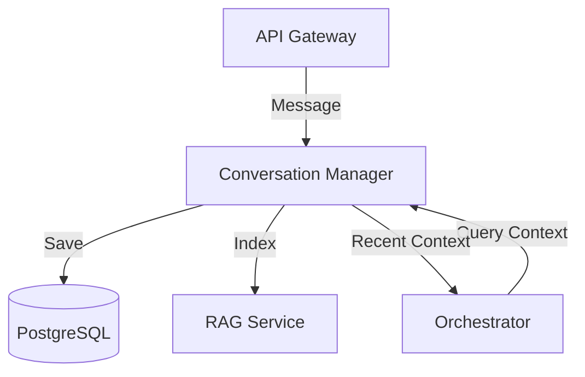

# 💬 Shared Conversations Module

The `shared/conversations` module provides the foundational data models and management logic for handling multi-turn interactions, session state, and message persistence within the Kea v4.0 system.

## ✨ Features

- **Persistent Session Management**: Handles the lifecycle of research-focused conversations, ensuring context is maintained across multiple user turns.
- **Structured Message Models**: Implements canonical `Message` and `Conversation` schemas with support for rich metadata, citations, and internal "thought" traces.
- **Vector-Indexed History**: Integrates with the RAG service to enable semantic search over past conversations, allowing agents to recall previously discussed concepts.
- **Audit Integration**: Automatically logs significant conversation events to the Vault's immutable audit trail.

## 📐 Architecture

The component follows a **Repository Pattern**, separating the database access logic from the application-level state management.

## 📁 Codebase Structure

- **`models.py`**: Defines the SQLAlchemy and Pydantic models for `Conversation` and `Message`.
- **`manager.py`**: The primary implementation of conversation persistence, retrieval, and message injection logic.

## 🧠 Deep Dive

### 1. Conversation Lifecycle
Conversations are more than just a list of strings. Each `Conversation` object tracks participants, domain tagging, and overall research progress. Messages within a conversation can be marked as `visible` to the user or `internal` (system thoughts/logs).

### 2. Context Window Management
The `ConversationManager` provides utilities to "prune" or "summarize" old messages when a conversation exceeds the LLM's context window, ensuring that the Orchestrator always receives the most salient information.

## 📚 Reference

| Class | Responsibility | Key Fields |
|:------|:---------------|:-----------|
| `Conversation` | Global container for a session. | `id`, `user_id`, `topic`, `metadata` |
| `Message` | A single piece of communication. | `role`, `content`, `timestamp`, `tokens` |
| `ConversationManager`| CRUD and search operations. | `get_history()`, `add_message()` |
