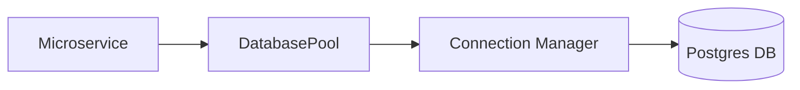

# 🗄️ Shared Database Component

The `shared/database` module provides a production-grade, asynchronous PostgreSQL connection pooling system for the Kea microservices architecture. Exclusively uses `asyncpg` for high-performance I/O.

## 🏗️ Architecture

The component implements a singleton-per-event-loop pattern to ensure efficient connection management across asynchronous tasks.



## ✨ Features

- **Asynchronous Pooling**: Built on `asyncpg` for non-blocking database operations.
- **Health Monitoring**: Integrated health check logic to monitor pool size, idle connections, and connectivity.
- **Singleton Pattern**: Managed lifecycle ensures only one pool per event loop, preventing resource leakage.
- **Environment Driven**: Automatic configuration from `DATABASE_URL`, `DATABASE_MIN_CONNECTIONS`, and `DATABASE_MAX_CONNECTIONS`.
- **Fail-Safe Startup**: Graceful handling of missing configuration in development environments.

## 📁 Component Structure

- `connection.py`: Core `DatabasePool` and `DatabaseConfig` classes.
- `health.py`: Detailed health metrics and connectivity validation logic.

## 🔌 API Reference

### Initialization
```python
from shared.database import get_database_pool

pool = await get_database_pool()
```

### Execution
```python
# Execute a query
await pool.execute("INSERT INTO audit_logs ...")

# Fetch rows
rows = await pool.fetch("SELECT * FROM jobs WHERE user_id = $1", user_id)

# Fetch single row
row = await pool.fetchrow("SELECT status FROM jobs WHERE job_id = $1", job_id)
```

### Health Check
```python
health = await pool.health_check()
# Returns: {"status": "healthy", "type": "postgresql", "pool_size": 20, "pool_free": 15}
```
