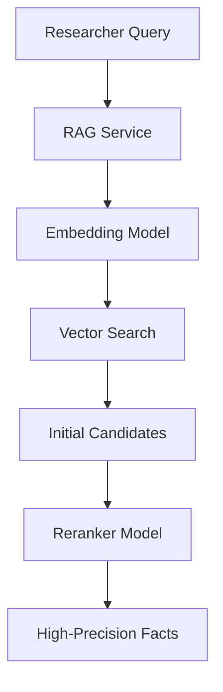

# 🔢 Shared Embedding & Reranking

The `shared/embedding` module provides the neural foundation for Kea's retrieval capabilities. It abstracts the models used for generating vector representations of text and the reranking logic used for high-fidelity fact selection.

## ✨ Features

- **Qwen3 Integration**: Primary support for Qwen3-based embedding and reranking models, optimized for technical and corporate research.
- **Vision-Language Support**: Specialized `Qwen3VL` models for embedding and reranking visual data (images, document snapshots).
- **Cross-Encoder Reranking**: Implementation of neural reranking to improve precision by evaluating the direct relevance of facts to the research query.
- **Model Lifecycle Management**: Automated loading, caching, and execution of local or remote models via a unified `ModelManager`.

## 📐 Architecture

The component acts as a high-performance utility layer consumed primarily by the RAG Service and the Orchestrator's "Keeper" node.

## 📁 Component Structure

- **`model_manager.py`**: Handles initialization and resource management for transformer-based models.
- **`qwen3_embedding.py`**: Implementation of text-to-vector transformation using Qwen3.
- **`qwen3_reranker.py`**: Logic for scoring query-fact pairs using cross-attention.
- **`qwen3_vl_...`**: Multi-modal variants for visual research tasks.

## 🧠 Deep Dive

### 1. The Reranking Advantage
Standard vector search (bi-encoders) is fast but can lose nuance. Kea uses a **Neural Reranking** stage where the top results from the vector database are re-evaluated by a cross-encoder. This ensures that even if a fact has low semantic similarity, its specific relevance to the query is detected before it reaches the synthesis stage.

### 2. Hardware Acceleration
The models automatically detect and utilize available GPU (CUDA) or MPS acceleration. On resource-constrained hardware, the `ModelManager` can fallback to optimized CPU runtimes (via `onnx` or `llama.cpp`) to maintain availability.

## 📚 Reference

| Class | Responsibility | Model Example |
|:------|:---------------|:--------------|
| `EmbeddingProvider`| Generates vector embeddings.| `Qwen/Qwen2.5-1.5B-Instruct` |
| `RerankerProvider` | Scores query-result pairs. | `BAAI/bge-reranker-v2-m3` |
| `VLProvider` | Multi-modal embeddings. | `Qwen/Qwen2-VL-7B-Instruct` |
