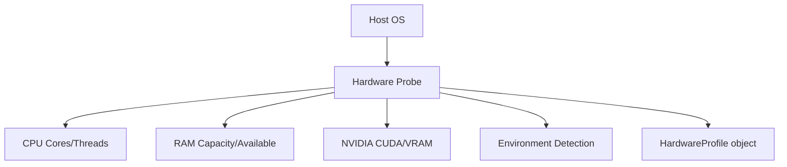

# 💻 Shared Hardware Detection

The `shared/hardware` module provides the system's "Self-Awareness" layer. It automatically detects underlying hardware capabilities (CPU, RAM, GPU) and runtime environments (Local, VPS, Colab, Kaggle) to optimize execution strategies.

## 🏗️ Architecture

The component uses a probe-and-profile strategy to build a `HardwareProfile` that other services use to scale their operations.



## ✨ Features

- **Adaptive Scaling**: Calculates `optimal_workers()` to prevent system crashes by balancing CPU threads and RAM availability.
- **Environment Awareness**: Detects specialized AI environments like Google Colab and Kaggle to enable specific optimizations.
- **GPU Acceleration**: Built-in support for detecting NVIDIA GPUs, VRAM availability, and CUDA capabilities via `torch`.
- **Memory Pressure Monitoring**: Provides real-time OOM (Out-of-Memory) risk assessment for high-load system tasks.
- **Auto-Refreshing**: Stats can be refreshed before critical operations to ensure the latest data is used.

## 📁 Component Structure

- `detector.py`: Main detection logic and `HardwareProfile` definition.
- `monitor.py`: Background monitoring for system resource usage.
- `executor_config.py`: Logic to translate hardware profiles into executor configurations.

## 🔌 API Reference

### Detection
```python
from shared.hardware import detect_hardware

profile = detect_hardware()
print(f"Threads: {profile.cpu_threads}, RAM: {profile.ram_total_gb}GB")
```

### Adaptive Decision Making
```python
# How many agents should I spawn?
num_workers = profile.optimal_workers()

# Is it safe to load a 4GB model?
if not profile.is_ram_oom_risk(required_gb=4.0):
    load_model()
```

### Resource Health
```python
pressure = profile.memory_pressure() # 0.0 to 1.0
if profile.is_constrained():
    enable_low_memory_mode()
```
