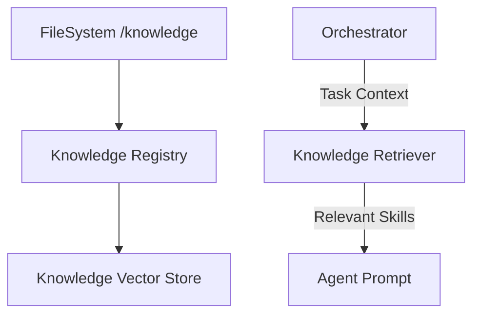

# 📖 Shared Knowledge Registry

The `shared/knowledge` module manages the system's "Built-in" intelligence. Unlike the RAG Service (which handles dynamic system findings), this module focuses on static, version-controlled assets like agent skills, organizational rules, and persona definitions.

## ✨ Features

- **Skill Registry**: Automatically indexes and provides semantic search for specialized agent capabilities defined in the `knowledge/skills/` directory.
- **Rules Engine**: Manages the "Corporate Policy" and "Compliance Rules" that govern agent behavior (e.g., GDPR, Security protocols).
- **Persona Management**: Stores and retrieves the high-level identity templates for the different "Silicon Employees" in the Fractal Corp.
- **Semantic Discovery**: Integrated `KnowledgeRetriever` that uses local embeddings to find the most relevant skills/rules for any given task.

## 📐 Architecture

The module bridges the gap between static Markdown/YAML files and the Orchestrator's runtime reasoning.

## 📁 Component Structure

- **`registry.py`**: Logic for scanning, parsing, and indexing files from the `knowledge/` root.
- **`retriever.py`**: Implementation of the semantic search interface for accessing rules and skills during the reasoning loop.

## 🧠 Deep Dive

### 1. Active Knowledge Sync
On startup, the `KnowledgeRegistry` performs a hash-based diff check of the `knowledge/` directory. Only modified files are re-vectorized, ensuring that developer updates to skills or rules are instantly reflected in the system's behavior without requiring a database migration.

### 2. Contextual Injection
When the Orchestrator plans a task, it doesn't just look at the user prompt. It uses the `KnowledgeRetriever` to find "Hidden Skills" that might be relevant. For example, a query about "Financial Statements" might pull the `edgar_retrieval` skill and the `corporate_finance_persona` automatically.

## 📚 Reference

| Category | Location | Purpose |
|:---------|:---------|:--------|
| **Skills** | `knowledge/skills/`| Step-by-step instructions for specific tools. |
| **Rules** | `knowledge/rules/` | Safety and logic guardrails for agents. |
| **Personas**| `knowledge/personas/`| High-level "Voice" and identity templates. |
