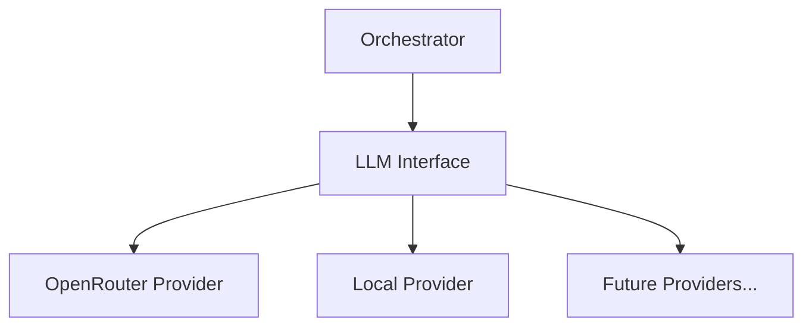

# 🧠 Shared LLM Component

The `shared/llm` module provides a unified, provider-agnostic interface for Large Language Models. It abstracts the complexities of different API structures (OpenRouter, OpenAI, Anthropic, etc.) into a consistent set of primitives.

## 🏗️ Architecture

The component follows a Provider pattern, where a base `LLMProvider` class defines the contract, and specialized classes implement the logic for specific backends.



## ✨ Features

- **Unified Interface**: Single `complete()` and `stream()` methods for all models.
- **OpenRouter Integration**: Native support for 100+ models via OpenRouter, including NVIDIA Nemotron and Gemini.
- **Reasoning Support**: Native handling of "Thinking" or "Reasoning" tokens for models like Nemotron-3.
- **Streaming by Default**: Robust server-sent events (SSE) compatible streaming.
- **Usage Tracking**: Standardized token usage reporting (prompt, completion, total, reasoning).
- **Environment Aware**: Automatically loads API keys and default models from the Project settings system.

## 📁 Component Structure

- `provider.py`: Abstract base classes and standardized data models (`LLMMessage`, `LLMConfig`, `LLMResponse`).
- `openrouter.py`: Production implementation for the OpenRouter API.

## 🔌 API Reference

### Initialization
```python
from shared.llm import OpenRouterProvider

provider = OpenRouterProvider()
```

### Simple Completion
```python
from shared.llm.provider import LLMMessage, LLMRole, LLMConfig

messages = [
    LLMMessage(role=LLMRole.USER, content="Explain quantum entanglement.")
]
config = LLMConfig(model="nvidia/nemotron-3-nano-30b-a3b:free")

response = await provider.complete(messages, config)
print(response.content)
```

### Streaming with Reasoning
```python
async for chunk in provider.stream(messages, config):
    if chunk.is_reasoning:
        print(f"Thinking: {chunk.reasoning}")
    else:
        print(f"Content: {chunk.content}")
```
