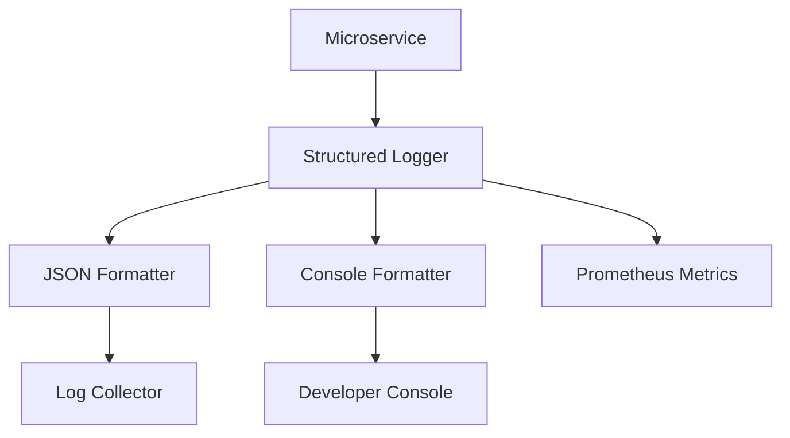

# 📊 Shared Logging & Observability

The `shared/logging` package provides a unified observability framework. It supports structured JSON logging, high-end vibrant console output, and Prometheus metrics tracking. All components are fully compliant with MCP JSON-RPC 2.0 and RFC 5424 severity standards.

## 🏗️ Architecture

The logging system is built for distributed environments, ensuring that logs from multiple microservices can be correlated via trace and request IDs.



## ✨ Features

- **Standardized Severity (RFC 5424)**: Supports levels from `DEBUG` up to `EMERGENCY` with consistent symbols and styling.
- **MCP Compliance**: Standardized JSON-RPC log notifications (`notifications/message`) for interoperability with MCP tools and hosts.
- **FastAPI Middleware**: Integrated `RequestLoggingMiddleware` for automatic request lifecycle logging, trace correlation, and latency metrics.
- **Prometheus Integration**: Automatic recording of API request counts, durations, and system metadata.
- **Standardized I/O Envelope**: Common models for logging inputs, outputs, RPC calls, and errors across the system.
- **Console Renderer**: A rich, vibrant console renderer for development, highlighting important metadata and I/O status.

## 📁 Package Structure

- `main.py`: The single source of truth containing core logic, renderers, middleware, and I/O models.
- `__init__.py`: Dynamic gateway with auto-discovery for all logging utilities.

## 🔌 API Reference

### Setup
```python
from shared.logging.main import setup_logging, LogConfig

# Initialize globally at service startup
setup_logging(LogConfig(service_name="orchestrator", level="info"))
```

### Basic Logging
```python
from shared.logging.main import get_logger

logger = get_logger(__name__)
logger.info("Operation completed", extra={"status": "success", "delay_ms": 120})
logger.success("Critical milestone reached")
```

### Protocol & I/O Logging
```python
from shared.logging import log_input, log_output, log_rpc_call

# Log standardized I/O envelopes
log_input(source="gateway", data=user_request)
log_rpc_call(source="orchestrator", target="vault", method="save_fact", params={"id": 1})
```

### MCP Notifications
```python
from shared.logging import log_mcp_message, LogLevel

# Send standardized MCP log notifications
log_mcp_message(source="analysis_server", level=LogLevel.INFO, data="Processing dataset...")
```

---
*This module ensures consistency and deep observability across all system components.*
