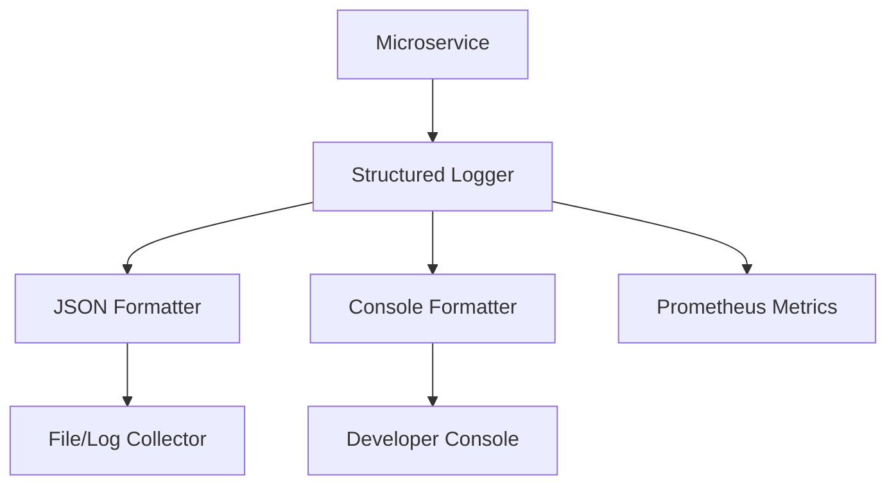

# 📊 Shared Logging & Observability

The `shared/logging` module provides a unified observability framework for the Kea system. it supports structured JSON logging, colored console output, request tracing, and business metrics tracking.

## 🏗️ Architecture

The logging system is built for distributed environments, ensuring that logs from multiple microservices can be correlated via trace IDs.



## ✨ Features

- **Structured JSON Logging**: Produces machine-readable logs with automatic ingestion of context, trace IDs, and exception details.
- **Request Tracing**: Lightweight implementation of traces and spans (similar to OpenTelemetry) for end-to-end request tracking.
- **Middleware**: Integrated FastAPI middleware for automatic request logging and trace propagation.
- **Business Metrics**: Specialized tracking for research-specific events (tool calls, token counts, cost).
- **Hardened Error Handling**: Sanitizes log records to prevent "DDoS by Logging" and ensures reserved keys (like `args`) are handled correctly.
- **Colorized Output**: High-readability console output for development environments.

## 📁 Component Structure

- `structured.py`: Core logic for JSON and Console formatters and setup.
- `tracing.py`: Implementation of `Trace` and `Span` classes and tracing middleware.
- `metrics.py`: Integration with Prometheus for system and business metrics.
- `context.py`: Thread-safe context storage for trace and request IDs.
- `mcp_middleware.py`: Specialized tracing for MCP tool calls.

## 🔌 API Reference

### Setup
```python
from shared.logging import setup_logging, LogConfig

setup_logging(LogConfig(service_name="orchestrator", level="INFO"))
```

### Basic Logging
```python
from shared.logging import get_logger

logger = get_logger(__name__)
logger.info("Task completed", extra={"job_id": "123", "duration": 0.45})
```

### Function Tracing
```python
from shared.logging.tracing import trace_function

@trace_function("search_database")
async def search():
    # Automatically creates a span for this function
    pass
```
