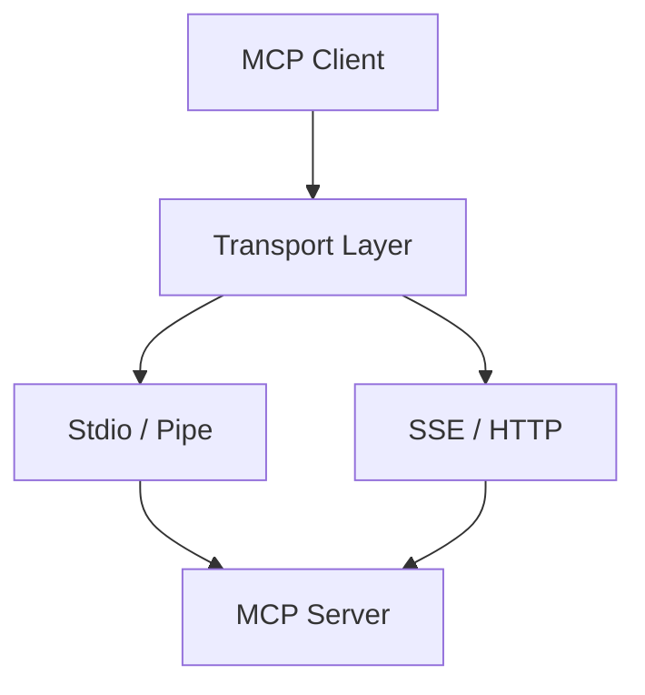

# 🔌 Shared MCP SDK

The `shared/mcp` module is the core implementation of the **Model Context Protocol (MCP)** for the Kea system. It provides the protocol primitives, transport abstractions, and client/server base classes required for tool-based agentic workflows.

## 🏗️ Architecture

Kea uses a "Pure MCP" architecture where the Brain (Orchestrator) and the Hands (MCP Host) communicate with Tool Servers exclusively via this SDK.



## ✨ Features

- **JSON-RPC 2.0 Compliance**: Full implementation of the JSON-RPC spec for MCP methods.
- **Multimodal Content**: Support for Text, Image, File, and Binary content types in tool results.
- **Pluggable Transports**: support for `StdioTransport` (subprocesses) and `SSETransport` (remote servers).
- **Tool Discovery**: Standardized `tools/list` and `tools/call` implementation.
- **JIT Compatibility**: Designed to work with the `uv`-based Just-In-Time execution model, handling long initialization timeouts.
- **Async First**: Fully asynchronous implementation using `asyncio`.

## 📁 Component Structure

- `protocol.py`: Pydantic models for the MCP/JSON-RPC specification.
- `client.py`: `MCPClient` for connecting to and invoking tools on servers.
- `server_base.py`: Base classes for creating new MCP servers.
- `transport.py`: Abstractions for communication channels (Stdio, SSE).
- `tool_router.py`: Advanced routing logic for dispatching calls to multiple internal tool handlers.

## 🔌 API Reference

### Creating a Client
```python
from shared.mcp.client import MCPClient
from shared.mcp.transport import StdioTransport

client = MCPClient()
transport = StdioTransport(command=["python", "server.py"])
await client.connect(transport)

tools = await client.list_tools()
```

### Invoking a Tool
```python
result = await client.call_tool("web_search", {"query": "Latest news"})
if not result.isError:
    for item in result.content:
        if item.type == "text":
            print(item.text)
```
