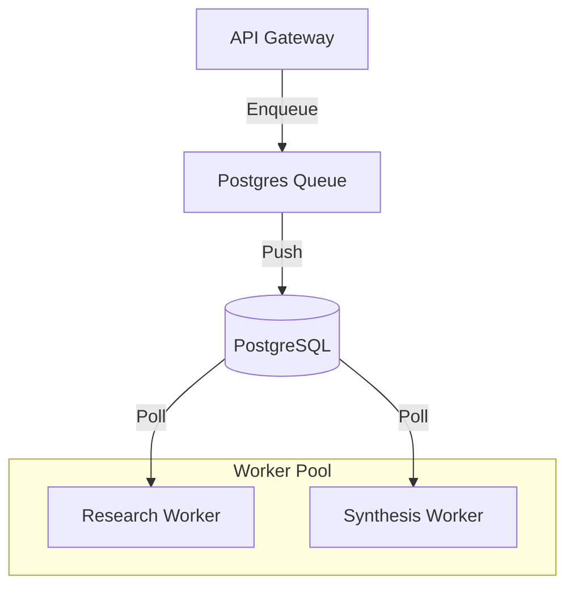

# 📥 Shared Persistent Queue

The `shared/queue` module provides a reliable, persistent task management system for Kea's asynchronous research jobs. It implements a **Producer-Consumer** pattern backed by PostgreSQL, ensuring that no task is lost even during service crashes or network outages.

## ✨ Features

- **PostgreSQL Persistence**: Uses a shared database table as a high-fidelity message broker, avoiding the complexity of external systems like RabbitMQ or Redis for small-to-medium clusters.
- **Priority-Based Dispatching**: Supports multi-level task prioritizing, ensuring that urgent research or system critical tasks are processed before background batching.
- **Atomic "Skip-Locked" Polling**: Leverages PostgreSQL's `FOR UPDATE SKIP LOCKED` for safe, high-concurrency polling by multiple worker nodes.
- **Job Lifecycle Tracking**: Built-in state management for tasks: `PENDING`, `RUNNING`, `COMPLETED`, `FAILED`, and `RETRY`.

## 📐 Architecture

The queue acts as the "Inbox" for the background workers, decoupling the API layer from the heavy execution layer.

## 📁 Component Structure

- **`queue.py`**: Abstract base classes and standardized `Task` data models.
- **`postgres_queue.py`**: Implementation of the persistent storage logic and concurrent polling engine.

## 🧠 Deep Dive

### 1. Reliable Task Processing
Unlike memory-based queues, Kea's queue ensures that a task is only marked as "Completed" after a successful worker callback. If a worker process dies mid-task, the `Visibility Timeout` mechanism ensures the task is automatically re-enqueued for another worker to pick up.

### 2. Multi-Worker Concurrency
The system is designed to scale horizontally. You can spin up 100 `ResearchWorker` pods, and each will use the `postgres_queue` to safely pull unique tasks without collisions, enabling massive parallel research operations across a GPU cluster.

## 📚 Reference

| Class | Responsibility | Key Fields |
|:------|:---------------|:-----------|
| `Task` | A single unit of work. | `id`, `name`, `payload`, `priority` |
| `PostgresQueue`| Storage and Polling. | `enqueue()`, `dequeue()`, `complete()` |
| `TaskStatus` | Job state machine. | `PENDING`, `RUNNING`, `SUCCESS`, `FAILURE` |
