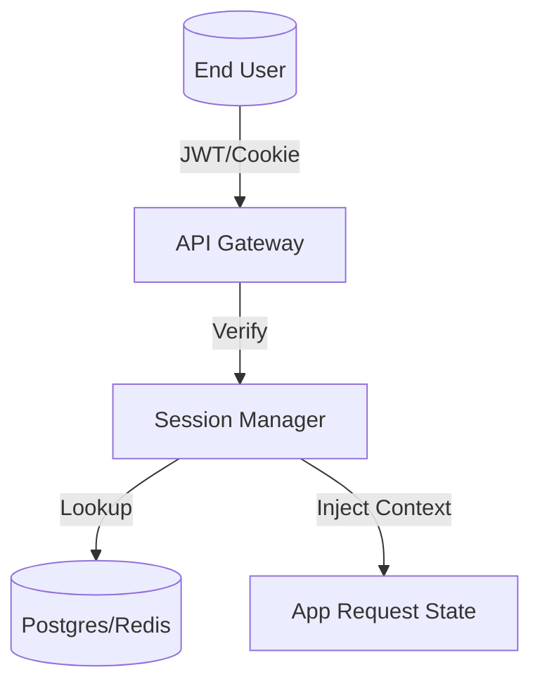

# 🔑 Shared Session Management

The `shared/sessions` module provides a lightweight state management system for tracking user interactions and ephemeral execution contexts. It functions as the "Short-Term Memory" and "Identity Persistence" layer for the Kea system.

## ✨ Features

- **Multi-Backend Session Storage**: Abstract interface supporting both in-memory (Dev) and PostgreSQL/Redis (Prod) session persistence.
- **JWT & Cookie Integration**: Works with the API Gateway to manage session tokens, lifetimes, and security rotations.
- **Context Pinning**: Allows specific system variables or "active projects" to be pinned to a user session for rapid retrieval.
- **Automated Expiry**: Built-in TTL (Time-To-Live) management for ephemeral tokens and guest sessions.

## 📐 Architecture

The module ensures that the Kea services remain stateless while still providing a stateful experience for the end-user.

## 📁 Component Structure

- **`manager.py`**: Implementation of the session lifecycle: creation, retrieval, extension, and invalidation.

## 🧠 Deep Dive

### 1. Stateless Scaling
By storing session data in a shared database rather than local memory, the Kea system can scale horizontally across multiple K8s pods. A user can start a system job on `gateway-pod-1` and check status on `gateway-pod-2` without any loss of context.

### 2. Session Scoping
Sessions in Kea can be scoped to specific domains or departments. This allows an admin to grant a temporary "Finance Department" session to a user, which automatically expires after the system job is completed, following the principle of least privilege.

## 📚 Reference

| Class | Responsibility | Key Fields |
|:------|:---------------|:-----------|
| `Session` | A single user interaction context. | `id`, `user_id`, `created_at`, `expires_at` |
| `SessionManager`| CRUD and validation operations. | `create()`, `get()`, `invalidate()` |
