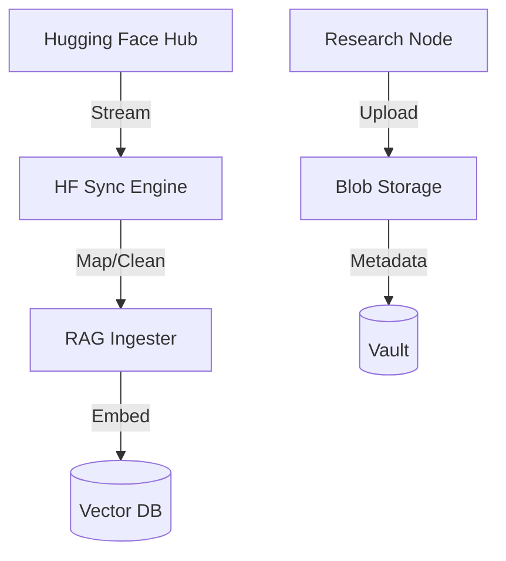

# ☁️ Shared Storage & Datasets

The `shared/storage` module manages the system's interface with large-scale data assets and external dataset repositories. It focuses on the reliable synchronization and ingestion of global knowledge bases into Kea's neural memory.

## ✨ Features

- **Hugging Face Synchronization**: Native `HFSync` utility for streaming, filtering, and ingesting massive datasets from the Hugging Face Hub (S3/Cloudfront).
- **Blob Storage Abstraction**: Unified interface for interacting with local filesystems, S3-compatible storage (MinIO), and cloud object stores.
- **Atomic Ingestion**: Ensures that large datasets are ingested in idempotent batches, allowing resumes after network interruptions.
- **Multimodal Artifact Handling**: manages the storage and versioning of research artifacts, including PDFs, CSVs, Parquet files, and image datasets.

## 📐 Architecture

The component acts as a high-bandwidth "Pipe" between external data lakes and the internal cognitive engine.

## 📁 Component Structure

- **`hf_sync.py`**: Core logic for interacting with the Hugging Face `datasets` library and managing the ingestion lifecycle.

## 🧠 Deep Dive

### 1. High-Throughput Ingestion
The `HFSync` implementation uses asynchronous streams and batch-parallelism to maximize throughput during initial knowledge loading. It handles schema mapping on-the-fly, allowing Kea to "Learn" from any public dataset on the web with minimal configuration.

### 2. Artifact Integrity
For regulated research, the storage layer calculates and verifies SHA-256 checksums for every artifact. This ensures that the PDF an agent "reads" in Phase 1 is the exact same file synthesized in the final Report phase, preventing invisible data corruption.

## 📚 Reference

| Class | Responsibility | Supported Backends |
|:------|:---------------|:-------------------|
| `HFSync` | Knowledge ingestion. | Hugging Face, S3 |
| `ArtifactStore`| Research file management. | Local, S3, Azure Blob |
| `FileMetadata` | In-transit integrity. | SHA-256, Content-Type |
