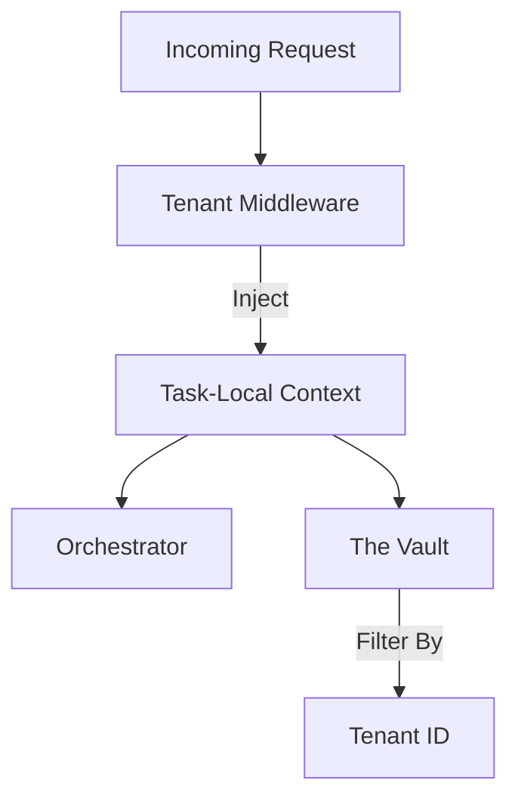

# 🏢 Shared Tenants & Compliance Context

The `shared/tenants` module provides the foundational support for multi-tenancy and organizational isolation in the Kea v0.4.0 architecture. It ensures that data, resources, and security policies are strictly partitioned between different "Departments" or "Clients" within the system.

## ✨ Features

- **Context-Bound Isolation**: Implements a thread-safe / task-local `TenantContext` that propagates the current organization's identity across service boundaries.
- **Dynamic Resource Partitioning**: enables services (like Vault and RAG) to automatically filter data based on the active `tenant_id`.
- **Org-Level Policy Enforcement**: Integrates with the Swarm Manager to apply custom compliance rules (GDPR, SOC2) at the tenant level.
- **Hierarchical Structures**: Supports "Parent-Child" organizational relationships, enabling corporate-wide visibility while maintaining department-level isolation.

## 📐 Architecture

The component implements a **Middleware & Provider** pattern to ensure that the tenant context is always available during request execution.

## 📁 Component Structure

- **`context.py`**: Implementation of the `TenantContext` using Python's `contextvars`, ensuring safety in high-concurrency `asyncio` environments.

## 🧠 Deep Dive

### 1. Data Leakage Prevention
The `TenantContext` is the primary defense against data leakage in multi-tenant environments. By injecting the `tenant_id` at the outermost edge (API Gateway) and propagating it through all internal calls, the system ensures that queries to the Vector DB or SQL tables are always restricted to the caller's authorized partition.

### 2. Regulatory Compliance
Different organizations have different regulatory requirements. The `tenants` module allows Project to "switch modes". For example, a tenant in the "EU" can have mandatory GDPR data minimization rules applied automatically, while a "US Finance" tenant might prioritize strict SOC2 audit logging.

## 📚 Reference

| Class | Responsibility | Key Properties |
|:------|:---------------|:---------------|
| `TenantContext` | current execution context. | `tenant_id`, `org_name`, `settings` |
| `TenantProvider`| Context retrieval and management.| `get_current()`, `as_tenant()` |
