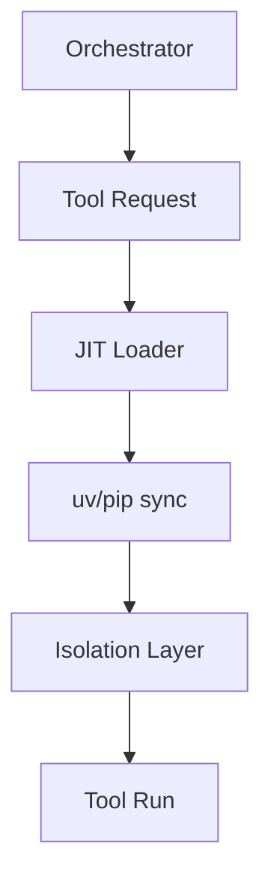

# 🛠️ Shared Tool Lifecycle & JIT Loading

The `shared/tools` module manages the lifecycle of agentic tools, focusing on secure process isolation and Just-In-Time (JIT) dependency management.

## 🏗️ Architecture

The component ensures that tools remain ephemeral and isolated, preventing dependency "hell" between different MCP servers.



## ✨ Features

- **JIT Dependency Management**: Uses `uv` (or `pip` fallback) to dynamically install required packages (e.g., `playwright`, `yfinance`) on-demand.
- **Security Sandboxing**: Implements package whitelist validation to prevent the execution of malicious or unauthorized code.
- **Process Isolation**: Ensures that each tool execution occurs in a clean environment, preventing side effects from affecting the main host.
- **Self-Healing Deployment**: Automatically repairs missing or broken tool environments on the first call.
- **GPU-Aware Installation**: Detects hardware and installs specialized GPU versions of packages (like `torch` or `cuda-libs`) when available.

## 📁 Component Structure

- `jit_loader.py`: Core logic for `uv`-based installation and dependency tracking.
- `isolation.py`: Logic for creating and managing isolated execution environments.

## 🔌 API Reference

### Ensuring Dependencies
```python
from shared.tools.jit_loader import ensure_tool

# This will check tools.yaml, install packages via uv, and return status
success = await ensure_tool("web_scraper")
```

### JIT Implementation (Internal)
```python
from shared.tools.jit_loader import get_jit_loader

loader = get_jit_loader()
await loader.ensure_server("analysis_server")
```

## ⚙️ Configuration

Dependency mappings are defined in `configs/tools.yaml`.
```yaml
tools:
  web_scraper:
    packages: ["playwright", "beautifulsoup4"]
    post_install: "playwright install chromium"
```
