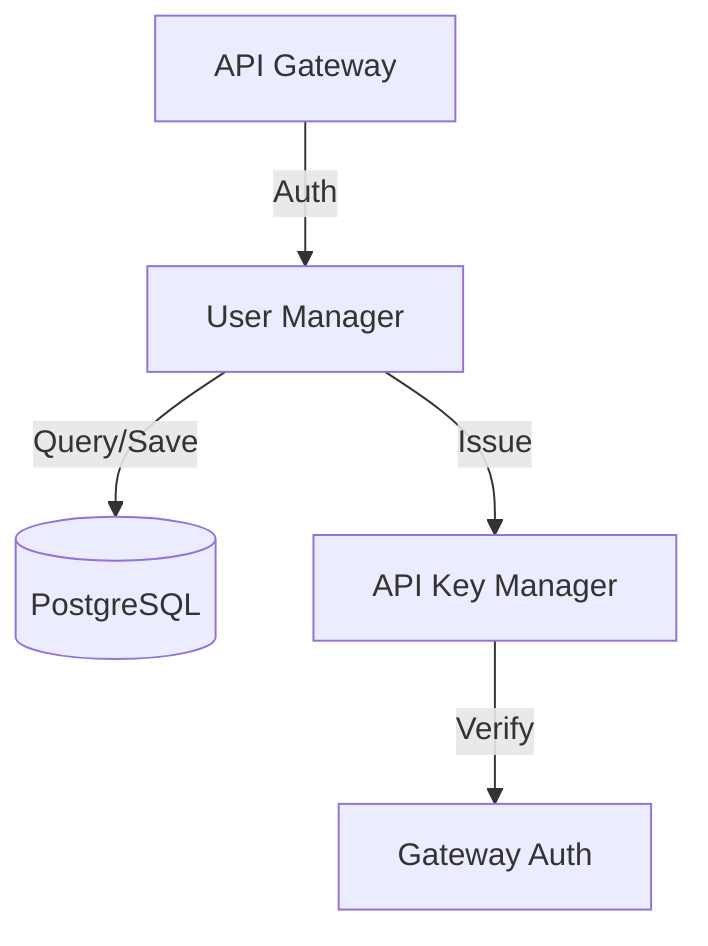

# 👤 Shared User Management

The `shared/users` module provides the core identity, profile, and API key management system for the Kea v0.4.0 architecture. It enables secure multi-user research sessions and delegated authorization for service-to-service communication.

## ✨ Features

- **Role-Based Access Control (RBAC)**: Supports multiple user roles (Admin, Researcher, Standard) to gate system capabilities.
- **Hierarchical API Key Management**: Allows users to generate scoped API keys for programmatic access without exposing their primary credentials.
- **Profile Persistence**: Manages persistent user preferences, research history, and organizational tags.
- **Service Integration**: Works in tandem with the API Gateway's authentication middleware to provide consistent user context across all microservices.

## 📐 Architecture

The component implements a **Service-Manager Pattern** to decouple the identity logic from the underlying storage.

## 📁 Component Structure

- **`models.py`**: Defines SQLAlchemy and Pydantic schemas for `User`, `ApiKey`, and `Profile`.
- **`manager.py`**: Implementation of high-level user lifecycle operations: registration, authentication, key rotation, and profile updates.

## 🧠 Deep Dive

### 1. Identity Propagation
Downstream services (like Orchestrator or Vault) do not perform their own authentication. They rely on the `User-ID` and `Scope` headers injected by the API Gateway after verification by this module. This "Zero-Trust" model ensures consistent security across the distributed corporation.

### 2. Secure API Keys
API keys are hashed with HMAC-SHA256 before storage. The `ApiKeyManager` supports expiration, usage quotas, and semantic scoping, allowing a key to be restricted to a specific research project or department (e.g., "Finance ONLY").

## 📚 Reference

| Class | Responsibility | Key Fields |
|:------|:---------------|:-----------|
| `User` | Global identity record. | `id`, `email`, `role`, `is_active` |
| `ApiKey` | Programmatic access token. | `user_id`, `key_hash`, `scopes`, `expires_at` |
| `UserManager` | Identity operations. | `authenticate()`, `create_user()`, `get_profile()` |
