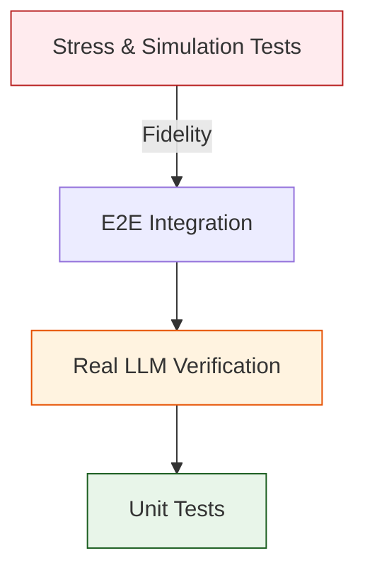

# 🧪 Test Suite ("The Quality Gate")

The Project Test Suite is a multi-layered verification system designed to ensure the stability, accuracy, and compliance of the Fractal Corp microservices architecture. It covers everything from atomic function units to massive 50-agent research simulations.

---

## 🏗️ Architecture Role: "Verify then Trust"

We utilize a **Pyramid Testing Strategy** to balance speed and fidelity:



1.  **Unit Tests (Fast)**: Verify individual functions and shared library logic (800+ tests).
2.  **Real LLM Tests (Paid)**: Verify that the Brain (LLM) correctly understands prompts and selects tools.
3.  **Integration Tests (Wired)**: Verify inter-service communication (e.g., Gateway → Orchestrator → MCP Host).
4.  **Verification Tests (Production)**: Smoke tests that run against live environments to ensure health.

---

## 📁 Codebase Structure

| Directory | Type | Description |
|:----------|:-----|:------------|
| **`unit/`** | **Unit** | Mocks all external calls. Fast and deterministic. |
| **`real/`** | **Functional**| Uses actual LLM APIs (OpenRouter/Nvidia). |
| **`integration/`** | **E2E** | Spins up multiple services to test pipeline flow. |
| **`mcp/`** | **Protocol** | Tests MCP server handshake and JSON-RPC compliance. |
| **`stress/`** | **Load** | Heavy research queries designed to stress parallel workers. |
| **`verify/`** | **Check** | Production readiness checks (Health, Version, Auth). |
| **`simulation/`**| **Chaos** | Simulates service failures and network latency. |

---

## 🏗️ Technical Deep Dive

### 1. The "Multibagger" Stress Test (`stress/stress_test.py`)
This is the ultimate system validator. It launches 20+ concurrent research jobs to test:
- **Parallel Dispatching**: Does the Orchestrator saturate the MCP Host?
- **Resource Recovery**: Does the system recover if an MCP process is force-killed?
- **Memory Consistency**: Do atomic facts from different agents collide or deduplicate correctly in the Vault?

### 2. LLM-Aware Assertions (`real/`)
Testing AI is non-deterministic. We use:
- **Semantic Overlap**: Instead of checking for exact strings, we use embeddings to verify the "Meaning" of a response matches the expected outcome.
- **Tool Call Mocking**: Verifies that the LLM generates the *correct JSON structure* for tool arguments.

---

## 🚀 Usage Reference

### Standard Execution
```bash
# Run all tests (Warning: takes 10+ minutes)
pytest tests/ -v

# Run fast unit tests only
pytest tests/unit/ -v

# Run tests for a specific service
pytest tests/unit/services/orchestrator/
```

### Key TCP Ports (Registry Truth)
If running integration tests, ensure your environment matches the **Service Registry**:
| Service | Port |
|:--------|:-----|
| **API Gateway** | `8000` |
| **Orchestrator** | `8001` |
| **MCP Host** | `8003` |
| **Vault** | `8004` |
| **Swarm Manager** | `8005` |
| **Chronos** | `8006` |

### Common Flags
| Flag | Meaning |
|:-----|:--------|
| `-v` | Verbose (show task names) |
| `-s` | Show `print()` output (useful for debugging LLM turns) |
| `-k "keyword"` | Run tests matching a name pattern |
| `--log-cli-level=INFO` | Show service logs in the terminal |

---

## 🔥 Stress Test Usage

The stress test runner supports both **predefined queries** (by ID) and **custom query strings**.

### Predefined Queries (by ID)
```bash
# Run predefined query #1 (Indonesian Alpha Hunt)
python -m pytest tests/stress/stress_test.py --query=1 -v -s --log-cli-level=DEBUG

# Run multiple predefined queries
python -m pytest tests/stress/stress_test.py --query=1,2,3 -v -s

# List all available predefined queries
python tests/stress/stress_test.py --list
```

### Custom Query Strings
```bash
# Run with a custom research query
python -m pytest tests/stress/stress_test.py --query="Analyze Apple stock performance Q4 2024" -v -s --log-cli-level=DEBUG

# Another custom query example
python -m pytest tests/stress/stress_test.py --query="What are the top 10 AI companies by market cap?" -v -s

# Direct execution (without pytest)
python tests/stress/stress_test.py --query="Compare Tesla vs BYD financials" -v
```

### Prerequisites
Before running stress tests, ensure all services are running:
```bash
# Terminal 1: API Gateway
python -m services.api_gateway.main

# Terminal 2: Orchestrator  
python -m services.orchestrator.main

# Terminal 3: RAG Service
python -m services.rag_service.main
```

### Output
Results are saved to `tests/stress/results/` including:
- `query_X_result.json` - Individual query metrics
- `stress_test_report.json` - Overall test summary
