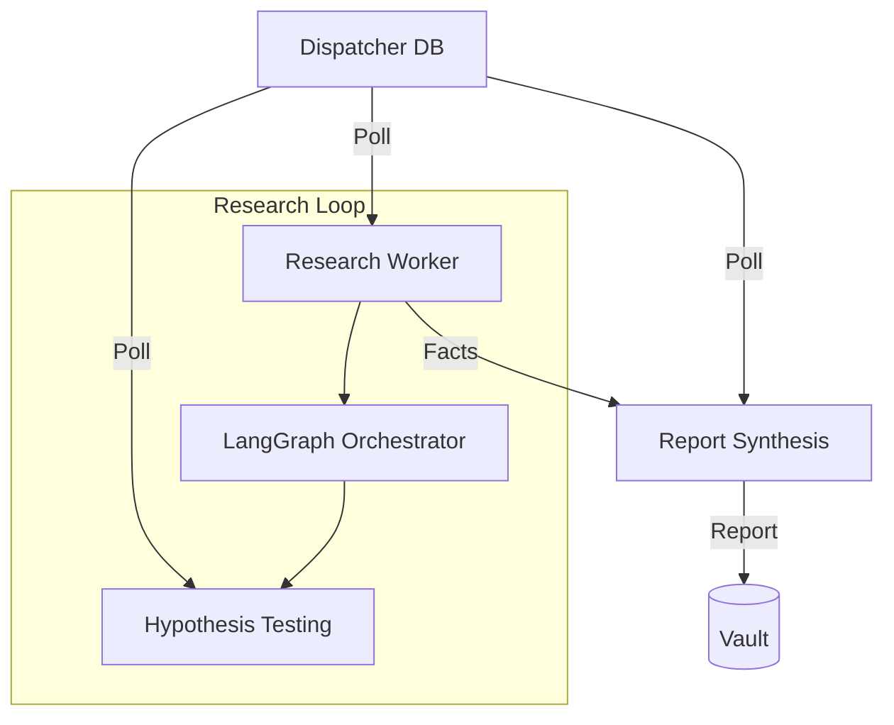

# ⚙️ Workers ("The Engines")

The `workers/` directory contains the background task processors that handle the heavy lifting of the Kea v0.4.0 research pipeline. These workers decouple long-running cognitive processes from the synchronous API layer, ensuring high throughput and resilience. They act as the "Line Workers" of the Fractal Corporation.

## ✨ Features

- **Asynchronous Execution**: Workers process jobs from a priority queue (managed by `dispatcher.py`), allowing the system to handle hundreds of concurrent research tasks.
- **Graph Orchestration**: The `ResearchWorker` is the primary orchestrator that executes the LangGraph cognitive loops.
- **Sandboxed Hypothesis Testing**: The `ShadowLabWorker` enables "Safe" execution of hypothesis-testing code in isolated environments.
- **Automated Synthesis**: The `SynthesisWorker` transforms raw `AtomicFact` collections into polished, human-readable research reports.
- **Observability**: Every worker is instrumented with Prometheus metrics (`ACTIVE_JOBS`, `JOBS_TOTAL`) and structured logging.

## 📐 Architecture

Kea uses a **Worker-Pool** pattern to manage computational complexity.



## 📁 Codebase Structure

- **`research_worker.py`**: The main execution engine. It compiles and runs the Orchestrator's research graph for each incoming job.
- **`shadow_lab_worker.py`**: Handles "What-If" scenarios and data simulations. It specifically manages the execution of Python code generated by the Planner.
- **`synthesis_worker.py`**: The final stage of the pipeline. It aggregates all evidence found during the research phase and uses a "Synthesizer" LLM to generate the final report.

## 🧠 Deep Dive

### 1. Research Graph Execution (`research_worker.py`)
The `ResearchWorker` is the link between the Stateless API and the Stateful Graph. It initializes the `GraphState` (Query, Iterations, Job ID) and calls `graph.ainvoke()`. This allows the Orchestrator to run autonomously for minutes or hours without blocking the user's connection.

### 2. Hypotheses & Simulations (`shadow_lab_worker.py`)
In many research tasks, simple search is not enough. The `ShadowLabWorker` allows agents to say: *"I hypothesize that X is true; let me write a Python script to verify it against the data."* This worker executes that script in an isolated sandbox and returns the result to the main graph.

### 3. Report Weaver (`synthesis_worker.py`)
This worker focuses on narrative quality. It uses specialized prompts to ensure that the final report follows the Kea standard (Executive Summary, Key Findings, Data Analysis, Conclusions), ensuring consistency regardless of the underlying research domain.

## 📚 Reference

### Worker Commands

To run a worker locally (often managed by the `Swarm Manager` automatically):

```bash
# Research Worker
uv run python -m workers.research_worker

# Shadow Lab Worker
uv run python -m workers.shadow_lab_worker

# Synthesis Worker
uv run python -m workers.synthesis_worker
```

### Metrics & Observability

| Metric | Type | Description |
|:-------|:-----|:------------|
| `active_jobs` | Gauge | Number of jobs currently being processed by the worker. |
| `jobs_total` | Counter| Total number of jobs completed (Success/Error). |
| `worker_latency_ms` | Histogram| Time taken to process a single task. |
